# ✅ Prerequisites

> Before starting this lab, make sure you have:

---

- [✅ Prerequisites](#-prerequisites)
  - [Check List](#check-list)
  - [Streams for Apache Kafka Document, Supported Lifecycles, LTS, Configuration](#streams-for-apache-kafka-document-supported-lifecycles-lts-configuration)
  - [Download Red Hat Streams for Apache Kafka](#download-red-hat-streams-for-apache-kafka)
  - [Install Red Hat Streams for Apache Kafka operator from the OperatorHub](#install-red-hat-streams-for-apache-kafka-operator-from-the-operatorhub)
  - [Install Web Terminal from the OperatorHub](#install-web-terminal-from-the-operatorhub)
  - [Enable User Workload Monitoring](#enable-user-workload-monitoring)
  - [Back to Table of Content](#back-to-table-of-content)

---

## Check List

Before starting this lab, make sure you have:

- [ ] An OpenShift Cluster (4.16+) with `cluster-admin` or sufficient permissions to install Operators.
- [ ] `oc` CLI installed and logged in to the cluster. The OpenShift oc command-line tool is installed and configured to connect to the running cluster.
- [ ] A storage class that supports `ReadWriteOnce` (for Kafka persistent storage)
- [ ] JDK (17/21) is installed if you plan to run Kafka clients locally. See the Release Notes for supported JDK versions.

Verify readiness before you begin:

```bash
# Confirm you're logged in
oc whoami

# Check available storage classes
oc get storageclass

# Confirm you can install operators
oc auth can-i create subscriptions -n openshift-operators
```

---

## Streams for Apache Kafka Document, Supported Lifecycles, LTS, Configuration

- [Streams for Apache Kafka 3.2 Documentation](https://docs.redhat.com/en/documentation/red_hat_streams_for_apache_kafka/3.2/)
- [Streams for Apache Kafka Lifecycle](https://access.redhat.com/support/policy/updates/jboss_notes#p_Streams)
- [Streams for Apache Kafka LTS Support Policy](https://access.redhat.com/articles/6975608)
- [Supported Configurations](https://docs.redhat.com/en/documentation/red_hat_streams_for_apache_kafka/3.2/html/release_notes_for_streams_for_apache_kafka_3.2_on_openshift/ref-supported-configurations-str)

---

## Download Red Hat Streams for Apache Kafka 

- Download Red Hat Streams for Apache Kafka Binary and OpenShift Installation and Example files from [Download Red Hat Streams for Apache Kafka](https://access.redhat.com/downloads/content/application-services/jboss.amq.streams/3.2.1/releases)
  
  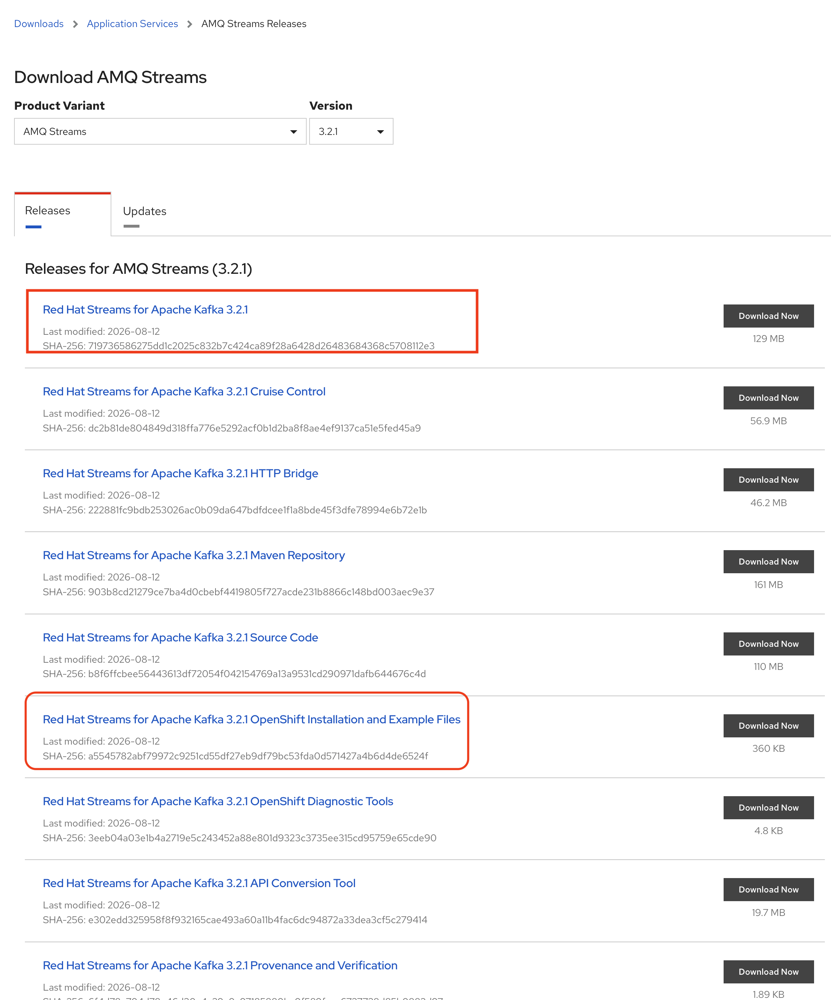

---

## Install Red Hat Streams for Apache Kafka operator from the OperatorHub

- Login to Openshift Console

  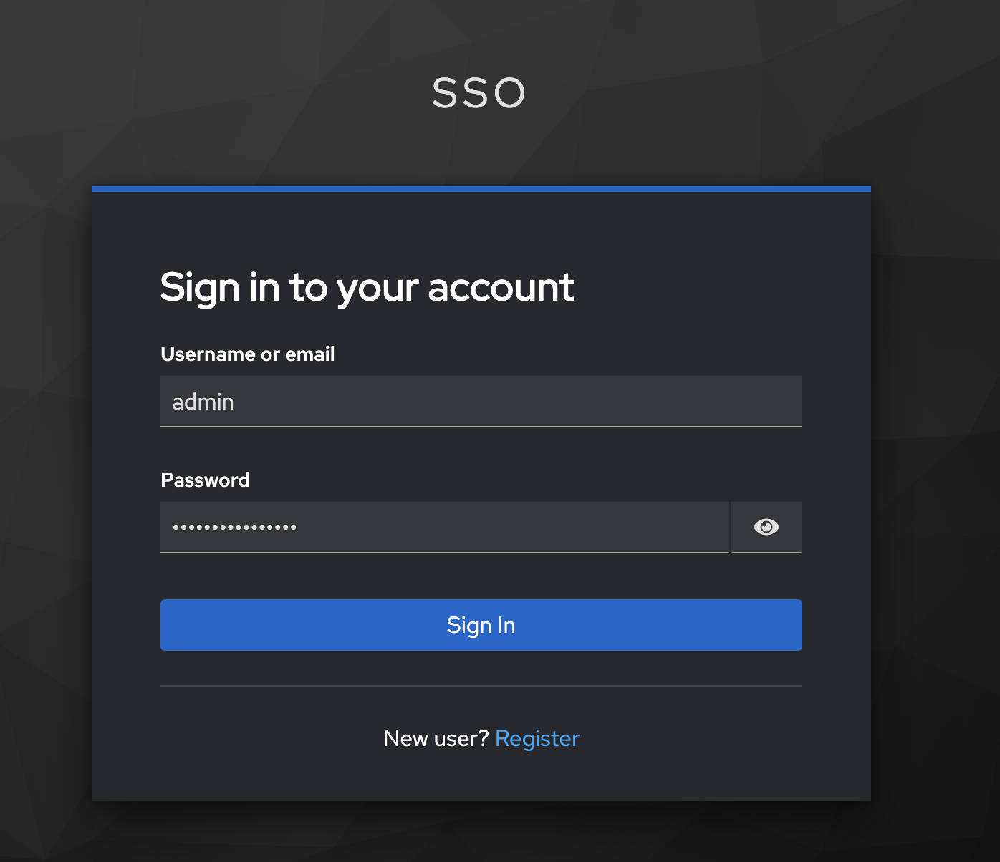

  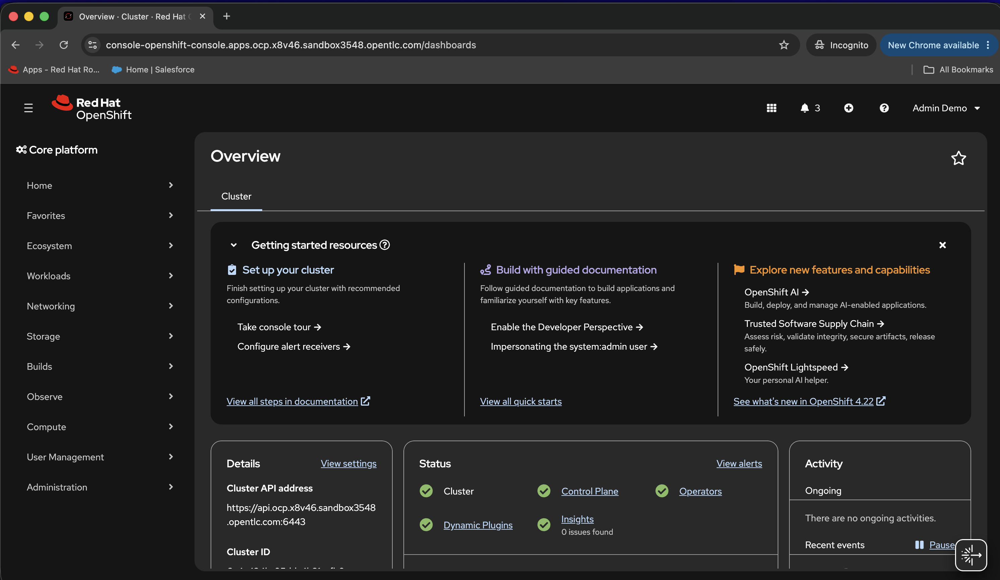

- From left menu, go to Ecosystem --> Software Catalog for Install Kafka Operator

  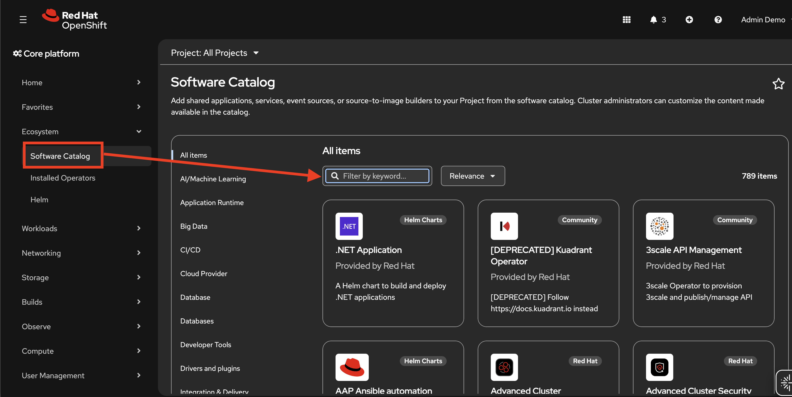

- Search with `kafka`, select `Streams for Apache Kafka`  

  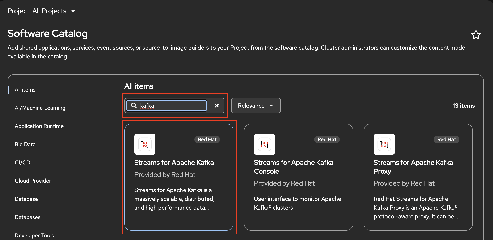

- Select Channel `stable` and Version `3.2` (or latest 3.2.x)

  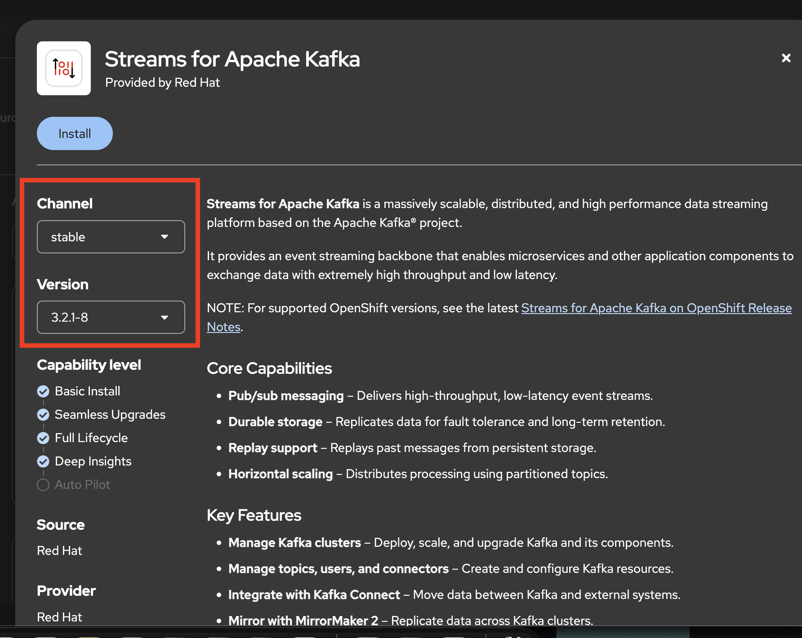

- Confirm Update channel to `stable` and version to `3.2.x`
- Confirm Installation mode (all namespace in cluster or specific namespace)
- Set Installed Namespace (Default or specific namespace)
- Update approval (recommend `Manual` for production), click Install

  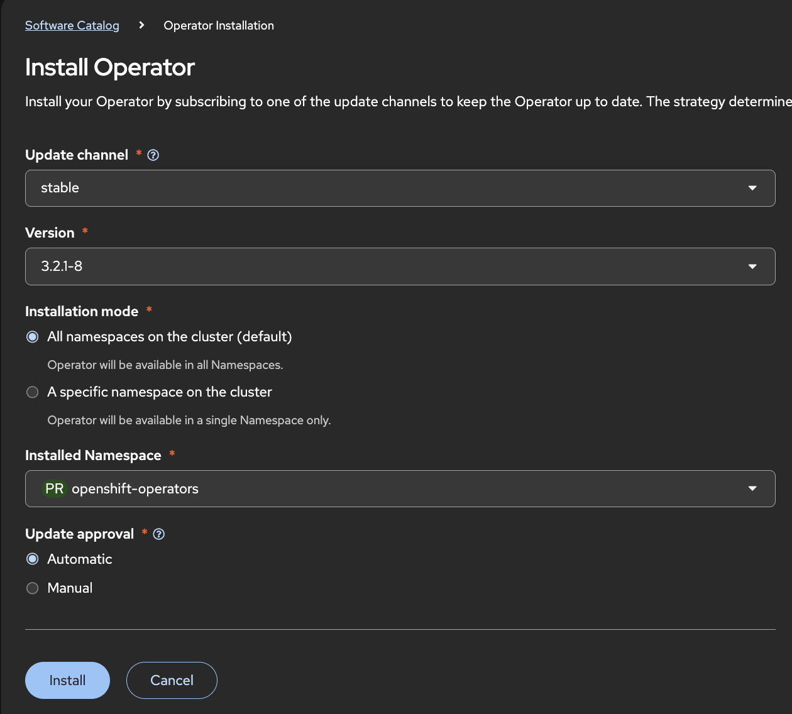

- Wait until operator commplete!

  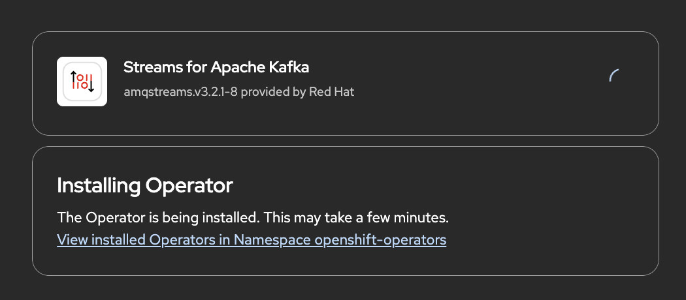    

- Click view Operator

  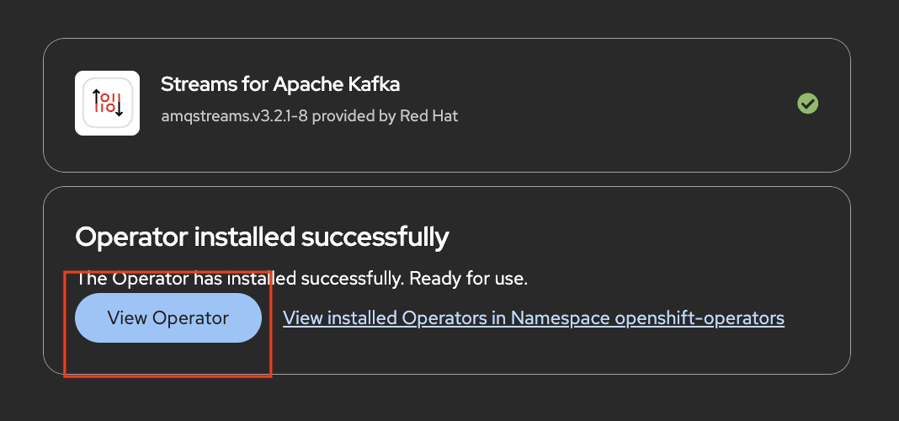

- View Operator Details

  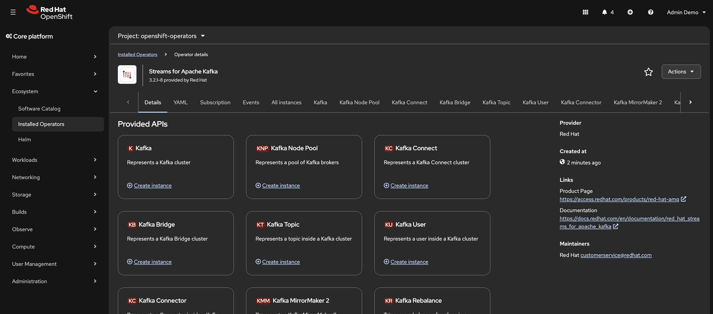              

---

## Install Web Terminal from the OperatorHub

- Go to Ecosystem, Software Catalog, search with `web terminal`
  
  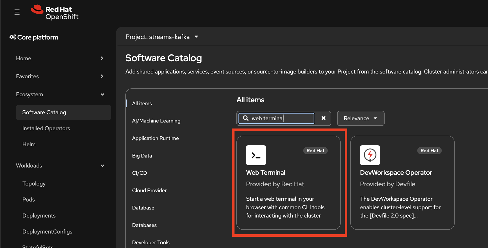 

- Leave default, click Install

  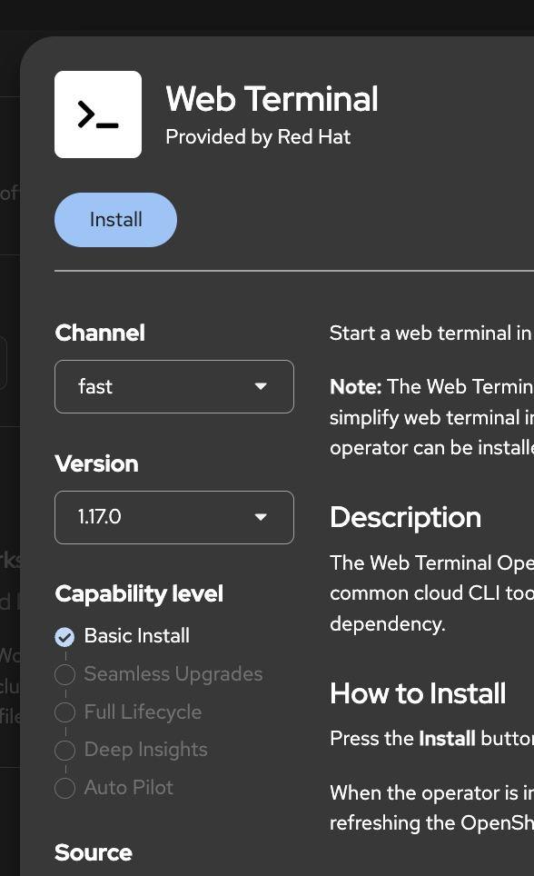 

- Leave default, click Install

  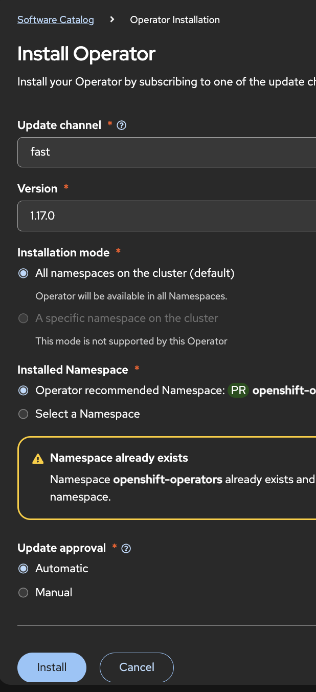 

- Check web terminal icon show at top right of OpenShift Console (or refresh page again)

  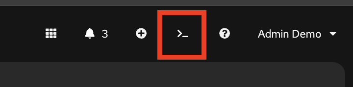 

---

## Enable User Workload Monitoring

---

## Back to Table of Content

- [Hands-On Lab: Red Hat Streams for Apache Kafka on OpenShift](../README.md)