# Scaling, Rebalance, Cruise Control

- [Scaling, Rebalance, Cruise Control](#scaling-rebalance-cruise-control)
  - [Scaling clusters by adding or removing brokers](#scaling-clusters-by-adding-or-removing-brokers)
  - [Add Broker and Reassign Partition with Cruise Control](#add-broker-and-reassign-partition-with-cruise-control)
  - [Reference](#reference)
  - [](#)
  - [Back to Table of Content](#back-to-table-of-content)

---

## Scaling clusters by adding or removing brokers

- Scaling Kafka clusters by adding brokers can improve performance and reliability. Increasing the number of brokers provides more resources, enabling the cluster to handle larger workloads and process more messages. It also enhances fault tolerance by providing additional replicas. Conversely, removing underutilized brokers can reduce resource consumption and increase efficiency. Scaling must be done carefully to avoid disruption or data loss. Redistributing partitions across brokers reduces the load on individual brokers, increasing the overall throughput of the cluster.

  Adjusting the replicas configuration changes the number of brokers in a cluster. A replication factor of 3 means each partition is replicated across three brokers, ensuring fault tolerance in case of broker failure:

- Create project `kafka-scale`

- Create Kafka Cluster with 
[kafka-cruise-control-with-goals.yaml](../manifests/examples/cruise-control/kafka-cruise-control-with-goals.yaml)

- Review Pods, Kafka, KafkaNodePool, PersistentVolumeClaims 
  
  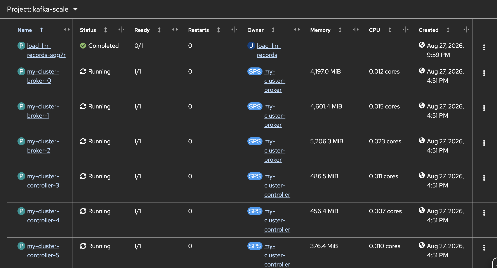
  
  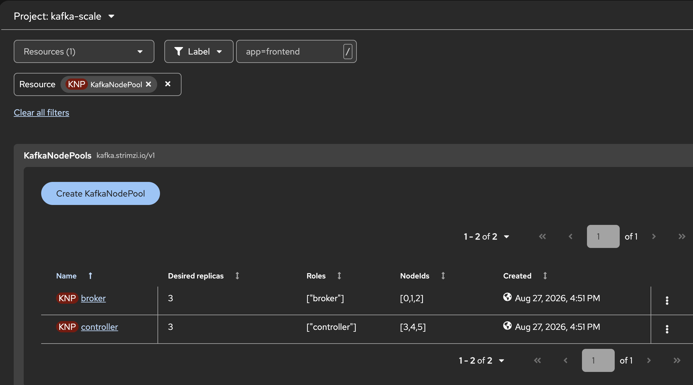 
  
  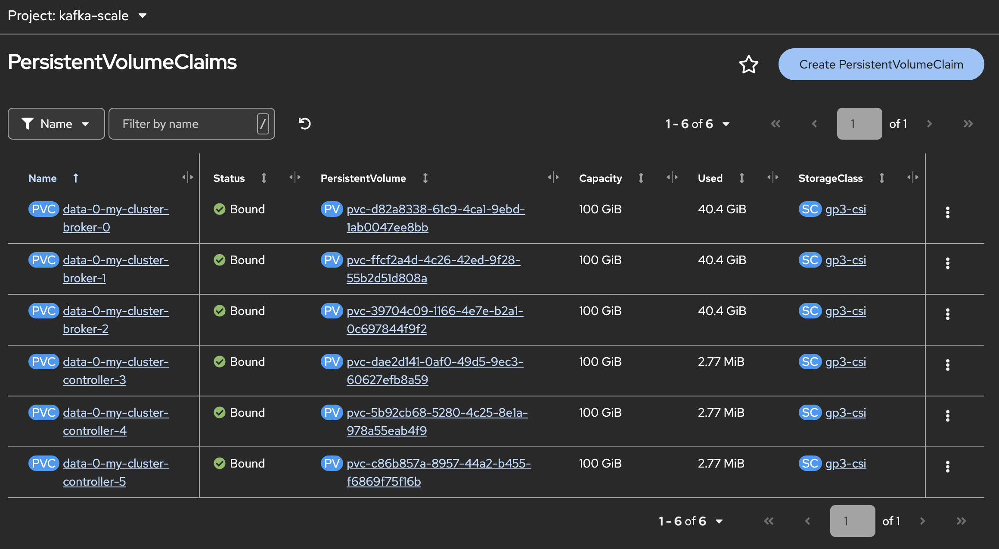  

- Create Kafka Topic with 
[topic.yaml](../manifests/examples/cruise-control/topic.yaml) 

- Check Kafka Topic Partition with command line

  ```ssh
  oc run kafka-util -ti \
  --image=registry.redhat.io/amq-streams/kafka-42-rhel9:3.2.0 \
  --rm=true \
  --restart=Never \
  -- bin/kafka-topics.sh \
  --bootstrap-server my-cluster-kafka-bootstrap:9092 \
  --describe --topic my-topic
  ```
  
  example result (distribute to broker 0,1,2)

  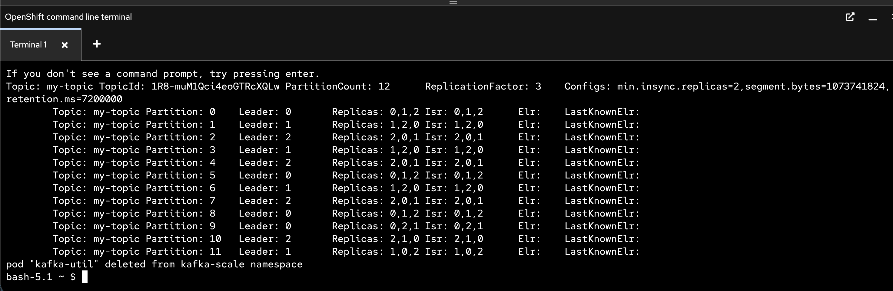

- Feed Data with job, [produce-job.jaml](../manifests/examples/cruise-control/produce-job.yaml)

- Recheck PVC Again!

---

## Add Broker and Reassign Partition with Cruise Control

- adjust replica of KafkaNodePool `broker` from 3 to 4, and `Save`
  
  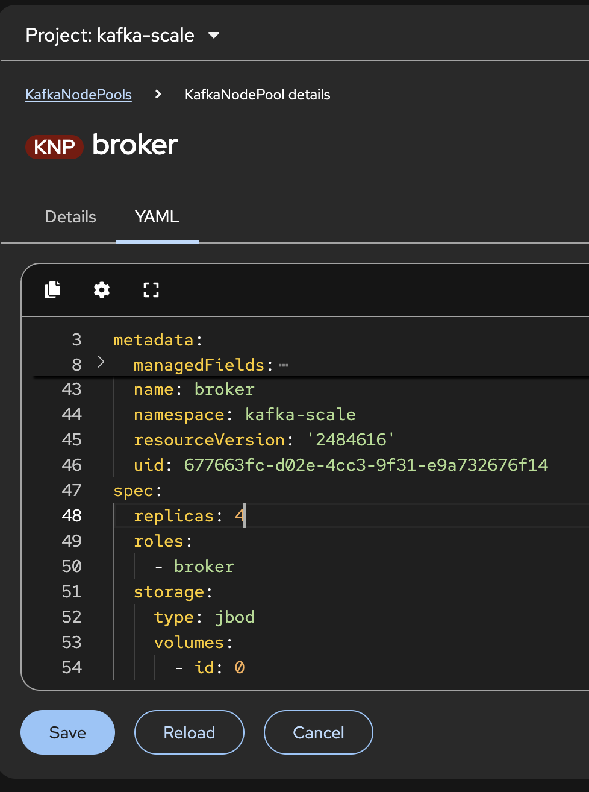 

  wait until new broker complete!

  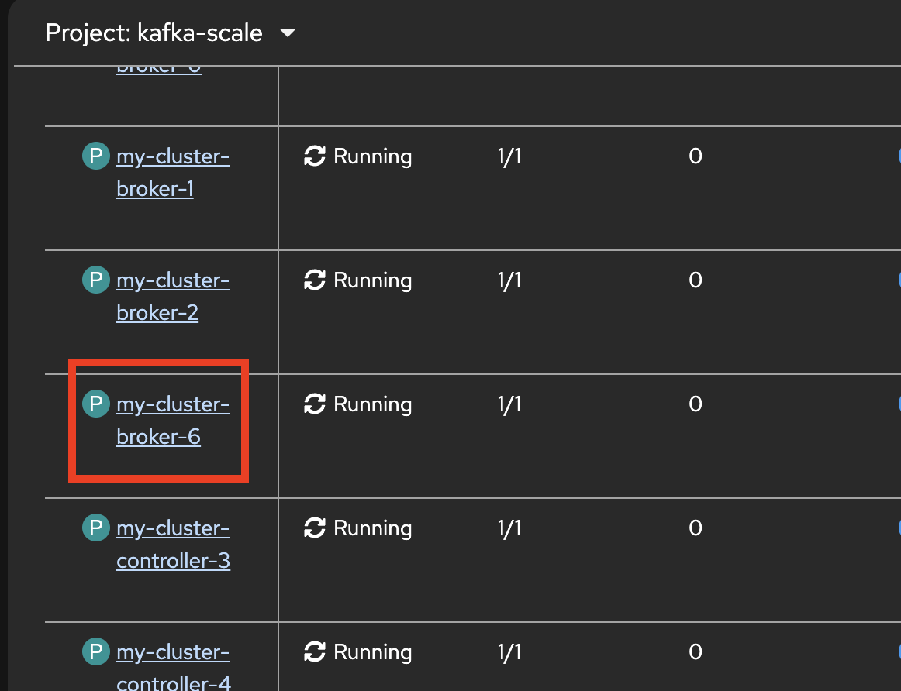 

  check new PVC!

  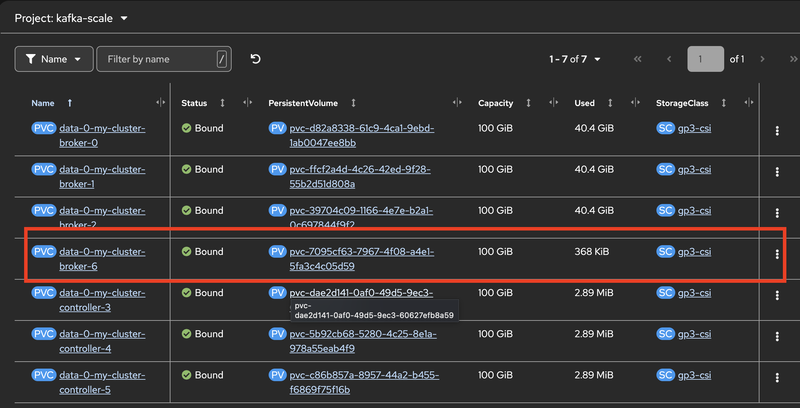 

- check Node Id from kafkanodepool `broker`
  
  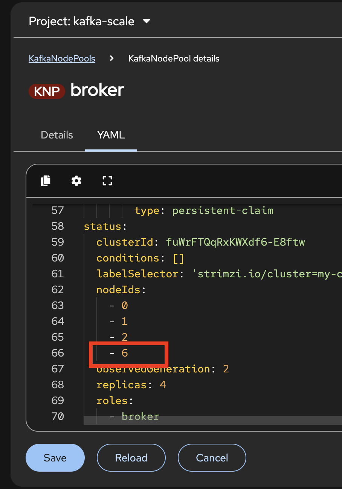 

- Check partition of topic `my-topic`

  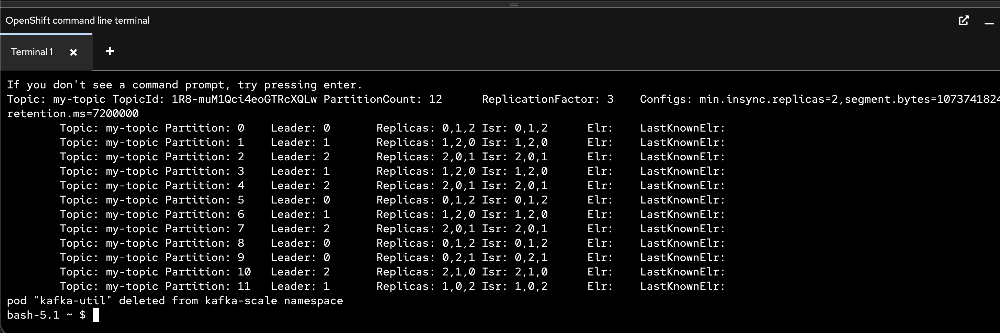

- Create Kafka Rebalance, mode add-broker, create from [kafka-rebalance-add-brokers.yaml](../manifests/examples/cruise-control/kafka-rebalance-add-brokers.yaml)

  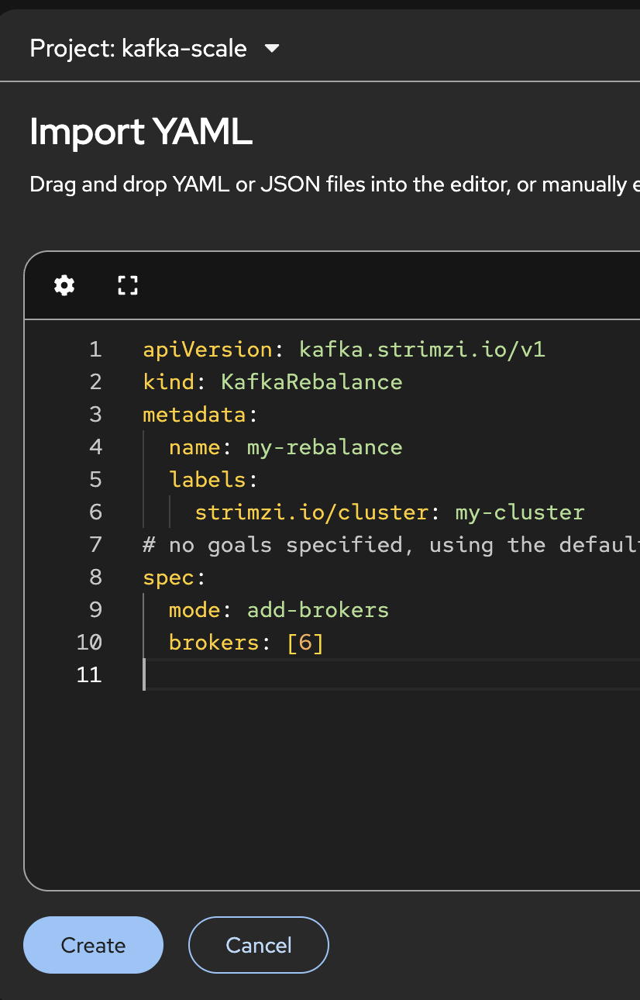

- wait until ProposalReady = `True`

  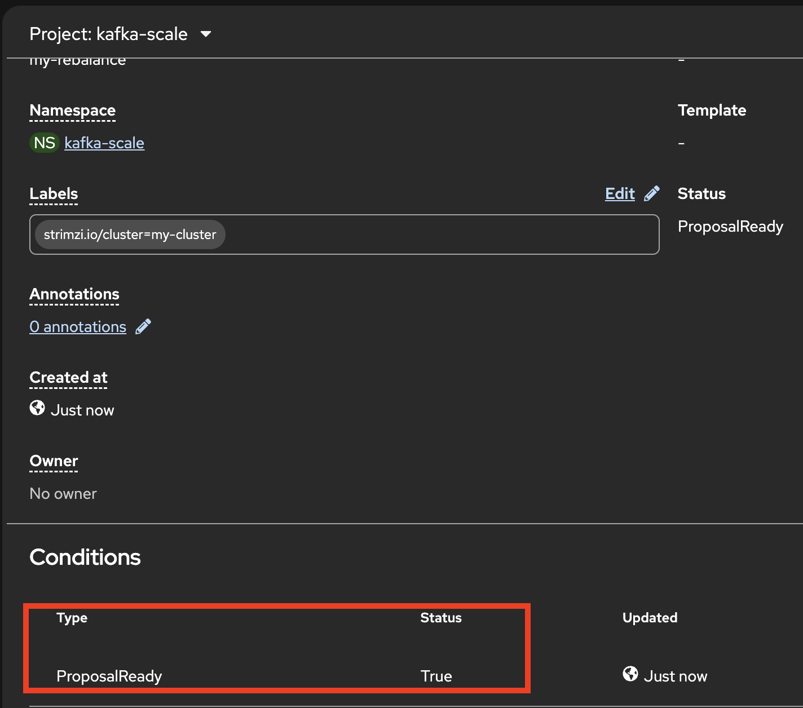 

  or with command line like this

  ```ssh
  oc describe kafkarebalance my-rebalance
  ```

- rerun current proposal, add annotation `strimzi.io/rebalance=rebalance="refresh"`
  
  ```ssh
  oc annotate kafkarebalance my-rebalance strimzi.io/rebalance="refresh"
  ```

- approve current proposal, add annotation `strimzi.io/rebalance=rebalance="approve"`
  
  ```ssh
  oc annotate kafkarebalance my-rebalance strimzi.io/rebalance="approve"
  ```  

- Check kafkarebalance `my-rebalance`

  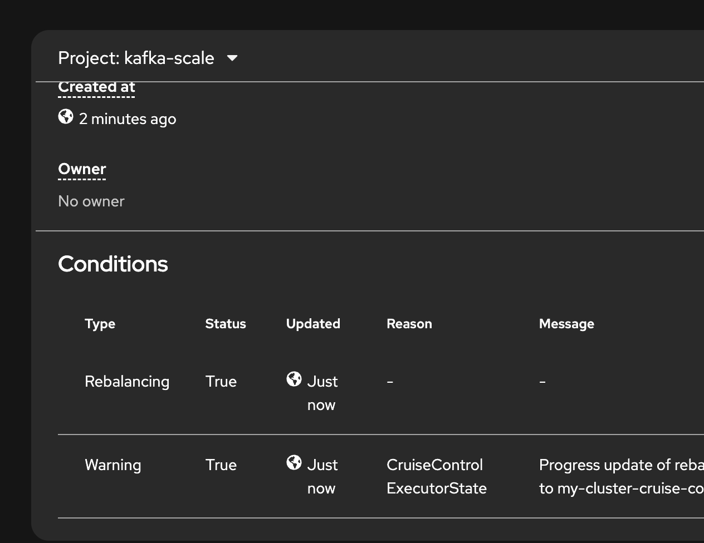 

- Wait until `Ready=True`

  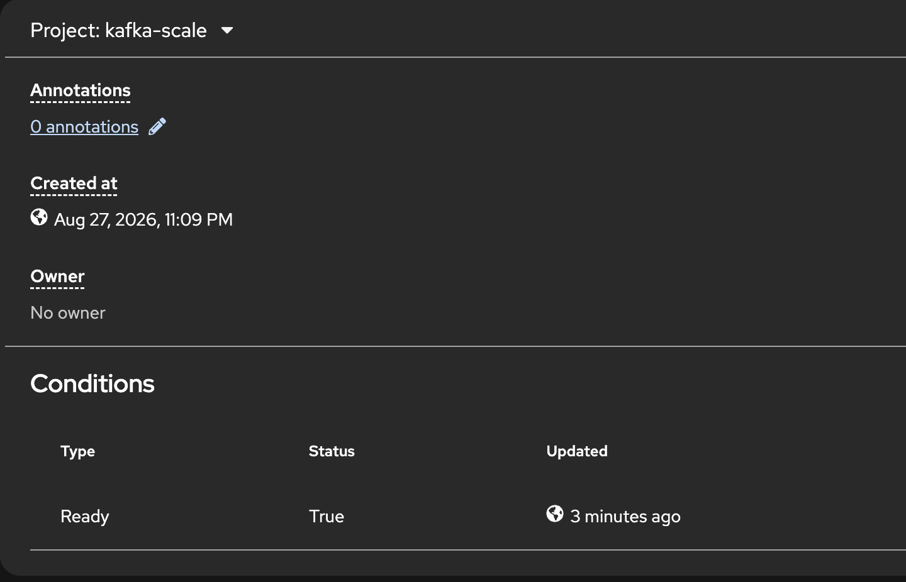 

- Check Topic `my-topic` again

  ```ssh
  oc run kafka-util -ti \
  --image=registry.redhat.io/amq-streams/kafka-42-rhel9:3.2.0 \
  --rm=true \
  --restart=Never \
  -- bin/kafka-topics.sh \
  --bootstrap-server my-cluster-kafka-bootstrap:9092 \
  --describe --topic my-topic
  ```

  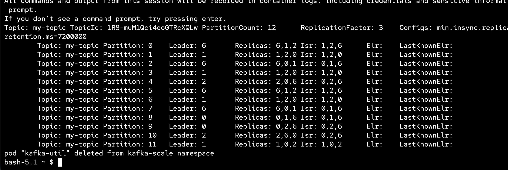 
  
  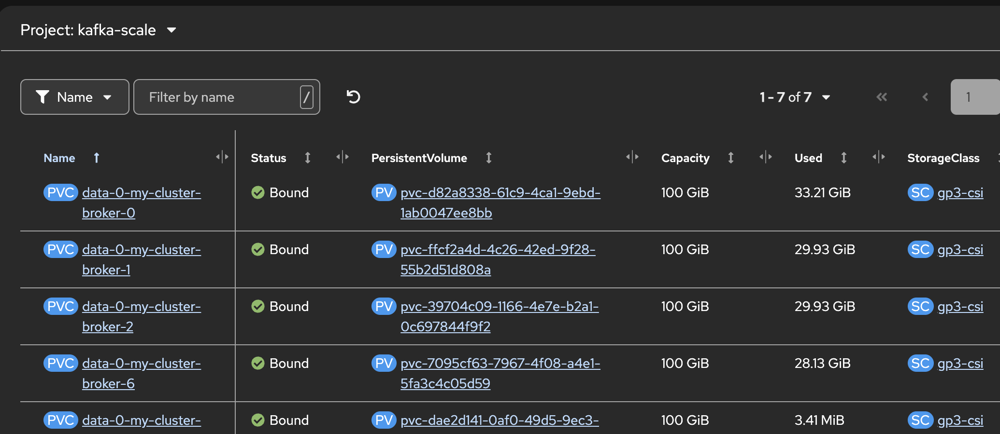 

---

## Reference

- [Using the partition reassignment tool (`kafka-reassign-partitions.sh`)](https://docs.redhat.com/en/documentation/red_hat_streams_for_apache_kafka/3.2/html-single/deploying_and_managing_streams_for_apache_kafka_on_openshift/index#assembly-reassign-tool-str)

- [Using Cruise Control for cluster rebalancing](https://docs.redhat.com/en/documentation/red_hat_streams_for_apache_kafka/3.2/html-single/deploying_and_managing_streams_for_apache_kafka_on_openshift/index#cruise-control-concepts-str)

  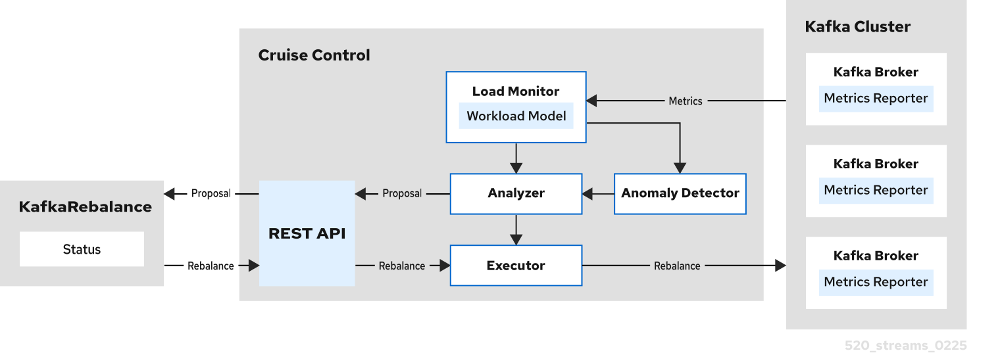
---

## Back to Table of Content

- [Hands-On Lab: Red Hat Streams for Apache Kafka on OpenShift](../README.md)