# Red Hat Streams for Apache Kafka Quickstart

> Try Streams for Apache Kafka by creating a Kafka cluster on OpenShift. Connect to the Kafka cluster, then send and receive messages from a Kafka topic.

---

- [Red Hat Streams for Apache Kafka Quickstart](#red-hat-streams-for-apache-kafka-quickstart)
  - [Create OpenShift Project](#create-openshift-project)
  - [Create Kafka Cluster (Ephemeral)](#create-kafka-cluster-ephemeral)
  - [Creating an OpenShift route to access a Kafka cluster (Optional)](#creating-an-openshift-route-to-access-a-kafka-cluster-optional)
  - [Create Kafka Topic with YAML (KafkaTopic CRD)](#create-kafka-topic-with-yaml-kafkatopic-crd)
  - [Test Kafka Cluster in OpenShift](#test-kafka-cluster-in-openshift)
  - [Back to Table of Content](#back-to-table-of-content)

---

## Create OpenShift Project

- Login to Openshift Console
- Go to left menu, select Home --> Project --> click Create Project or From previous step, Installed Operators, select Project dropdownlist --> Click Create Project
  
  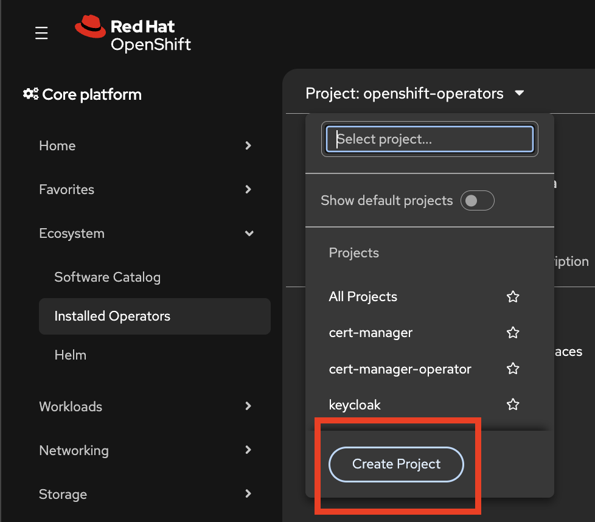

- create project, set Name: `streams-kafka`

  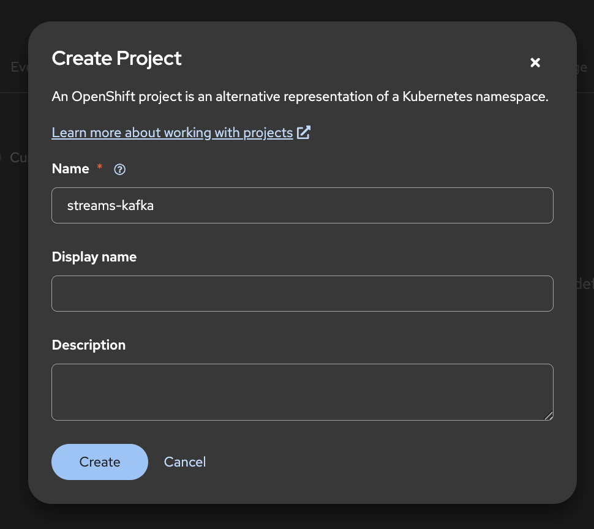

---

## Create Kafka Cluster (Ephemeral)

- From left menu, select Workloads --> Topology under Project : `streams-kafka`
- Click Add to Project icon

  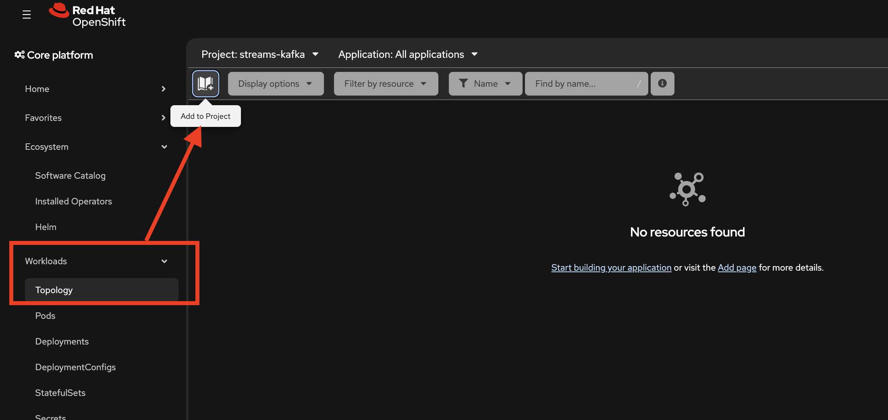

- search with `kafka`, select `Kafka` and Click Create

  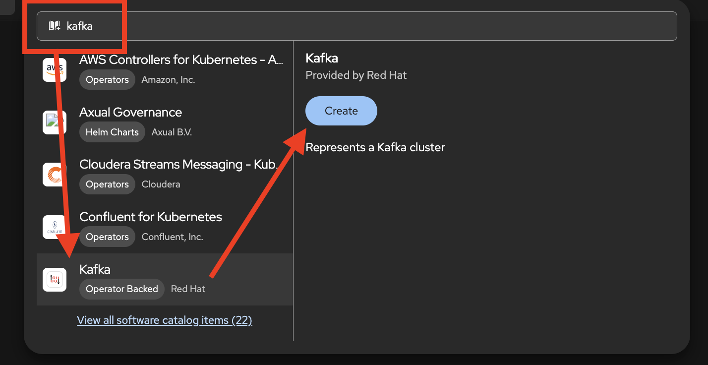

- In Create Kafka, change From view to YAML view

  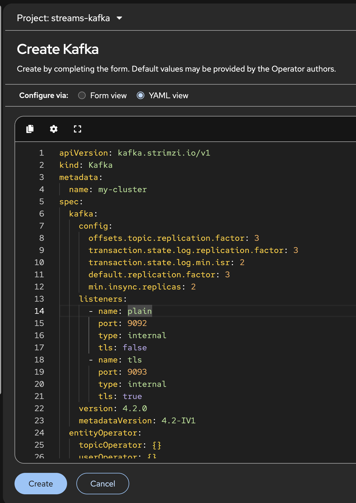  

- Replace default yaml with below configuration to create kafka cluster
  
  ```yaml
  apiVersion: kafka.strimzi.io/v1
  kind: Kafka
  metadata:
    name: my-cluster
  spec:
    kafka:
      config:
        offsets.topic.replication.factor: 3
        transaction.state.log.replication.factor: 3
        transaction.state.log.min.isr: 2
        default.replication.factor: 3
        min.insync.replicas: 2
      listeners:
        - name: plain
          port: 9092
          type: internal
          tls: false
        - name: tls
          port: 9093
          type: internal
          tls: true
      version: 4.2.0
      metadataVersion: 4.2-IV1
    entityOperator:
      topicOperator: {}
      userOperator: {}
  ```

  example output 

  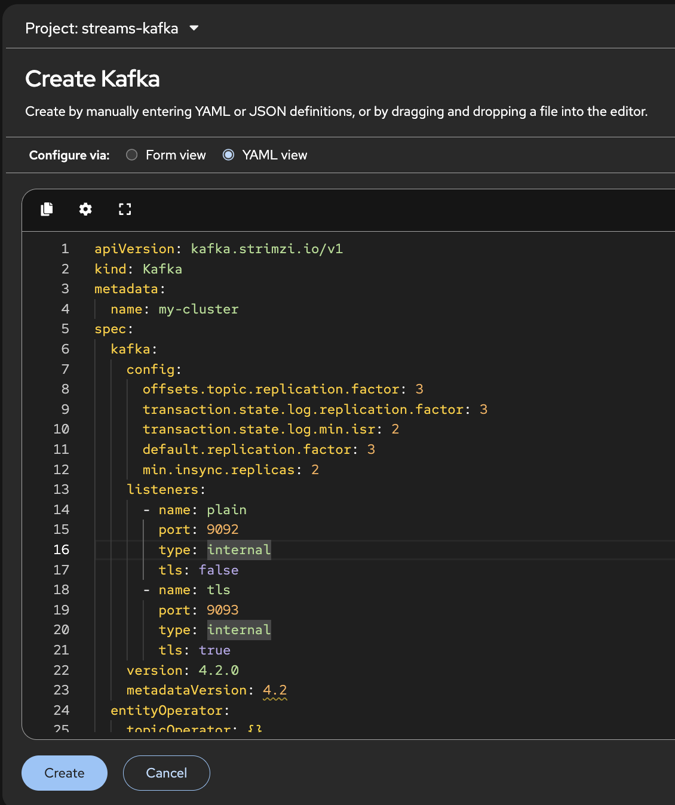 

- Use [Streams for Apache Kafka API Reference](https://docs.redhat.com/en/documentation/red_hat_streams_for_apache_kafka/3.2/html/streams_for_apache_kafka_api_reference/index) for more detail Use the configuration properties of the Streams for Apache Kafka API to fine-tune your deployment.  

- **Remark** "IV" in metadataVersion stands for **Internal Version**. In Apache Kafka (KRaft mode) and Strimzi, `metadata.version` specifies the precise schema format of the metadata log and the internal communication protocols used between Brokers and Controllers.

- From Kafka Object in Streams for Apache Kafka Operator, The Kafka status initially shows as NotReady. This is expected until node pools are added.

  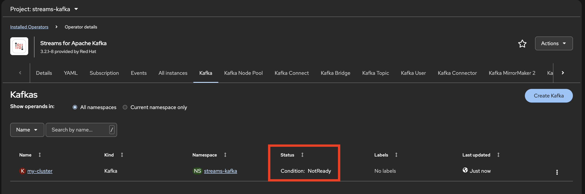 

- click `my-cluster` kafka, in Details tab, view Conditions

  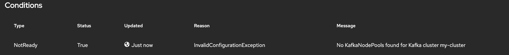 

- In Kafka Operator, change to Kafka Node Pool tab, Click Create KafkaNodePool

  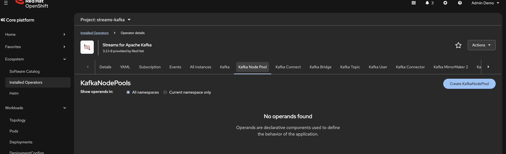 

- Change to YAML view, Input below yaml to create broker, Click Create

  ```yaml
  apiVersion: kafka.strimzi.io/v1
  kind: KafkaNodePool
  metadata:
    name: broker
    labels:
      strimzi.io/cluster: my-cluster
  spec:
    replicas: 3
    roles:
      - broker
    storage:
      type: jbod
      volumes:
        - id: 0
          type: ephemeral
  ```

  example output

  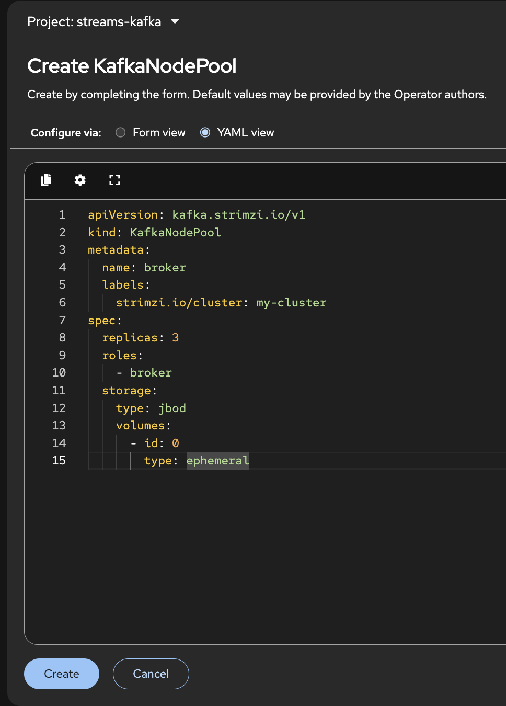 

- Click Create KafkaNodePool again, Change to YAML view, Input below yaml to create controller, Click Create (set kraftMetadata at volume id:0)

  ```yaml
  apiVersion: kafka.strimzi.io/v1
  kind: KafkaNodePool
  metadata:
    name: controller
    labels:
      strimzi.io/cluster: my-cluster
  spec:
    replicas: 3
    roles:
      - controller
    storage:
      type: jbod
      volumes:
        - id: 0
          type: ephemeral
          kraftMetadata: shared

  ```

  example output

  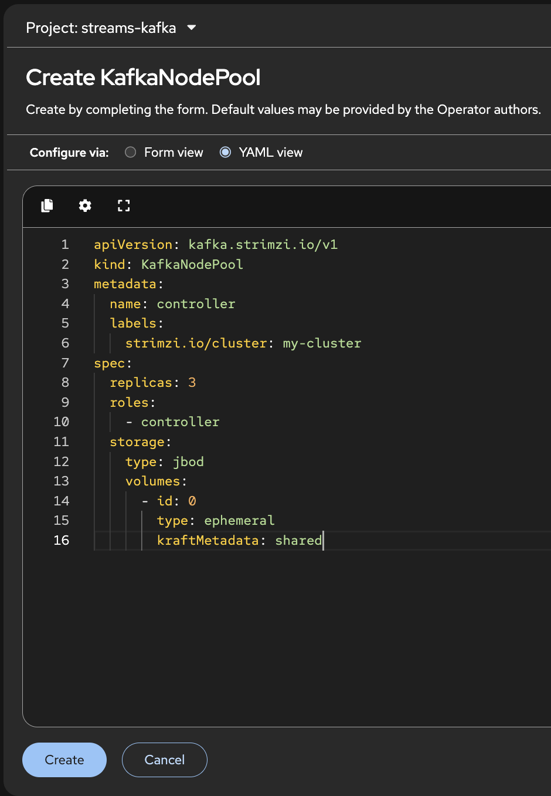 

- Review KafkaNodePools

  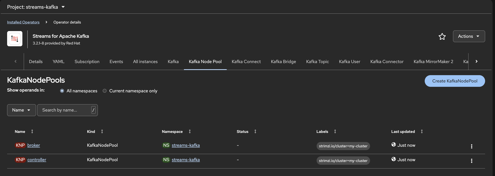 

- Review Kafka change status to `Ready`

  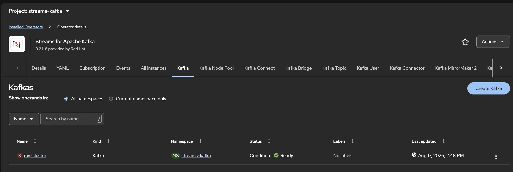 

- Review Kafka Pod, from left menu, select Workloads --> Pods, select Project: `streams-kafka`

  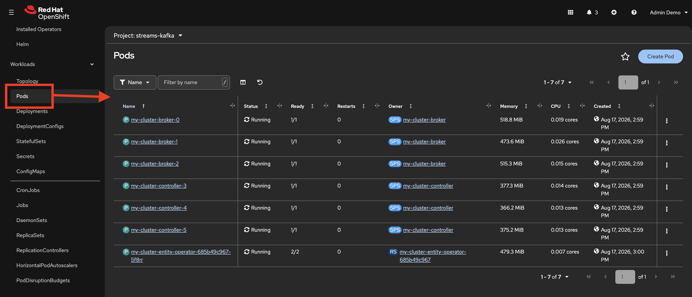 

- Review Kafka Service, from left menu, select Networking --> Services (listener type `internal` will create only one headless service)

  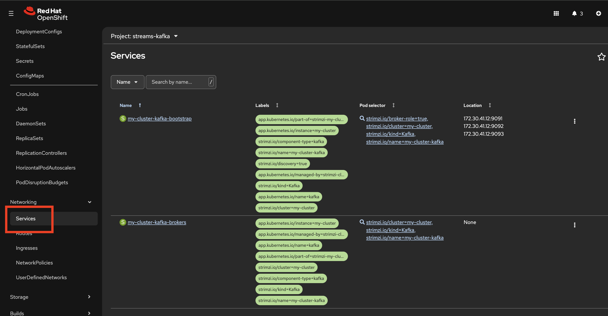 

---

## Creating an OpenShift route to access a Kafka cluster (Optional)

- Reference Document to [Setting up client access to a Kafka cluster](https://docs.redhat.com/en/documentation/red_hat_streams_for_apache_kafka/3.2/html/deploying_and_managing_streams_for_apache_kafka_on_openshift/deploy-client-access-str)

- Back to kafka cluster : `my-cluster`, in kafka operator and change to YAML tab

  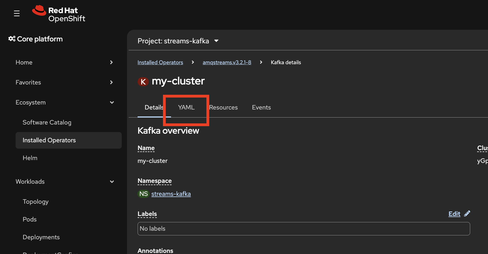 

- Add new listener type OpenShift Route, see example in below yaml

  ```yaml
  apiVersion: kafka.strimzi.io/v1
  kind: Kafka
  metadata:
    name: my-cluster
    namespace: streams-kafka
  spec:
    kafka:
      # ...
      listeners:
        # ...
        - name: listener1
          port: 9094
          type: route
          tls: true
  # ...

  ```

  example output

  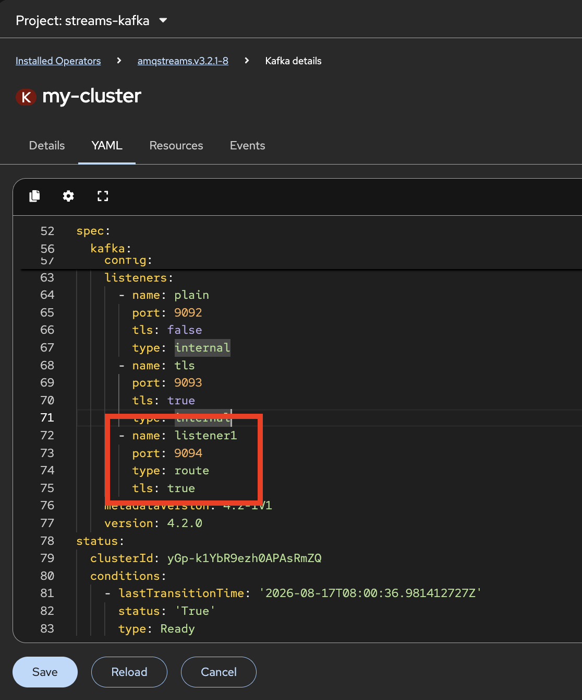 

- Click save
- Check new service, go to Networking --> Services 

  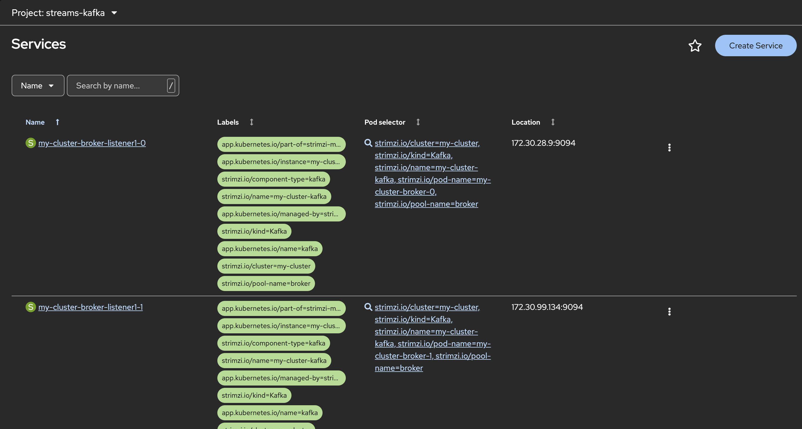 

- Check route, go to Networking --> Routes

  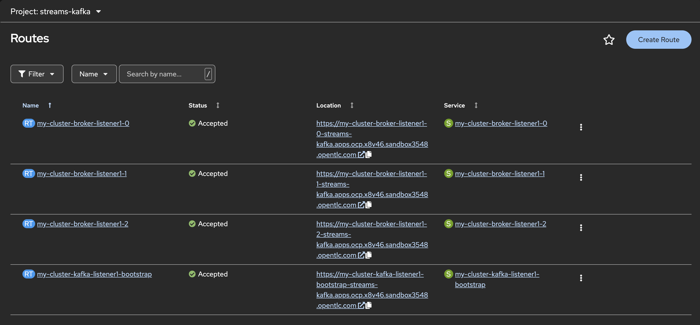 

- View bootstrap route, click `my-cluster-kafka-listener1-bootstrap`
- check Host Name value (for client access with port 443) such as `my-cluster-kafka-listener1-bootstrap-streams-kafka.apps.ocp.x8v46.sandbox3548.opentlc.com:443`

  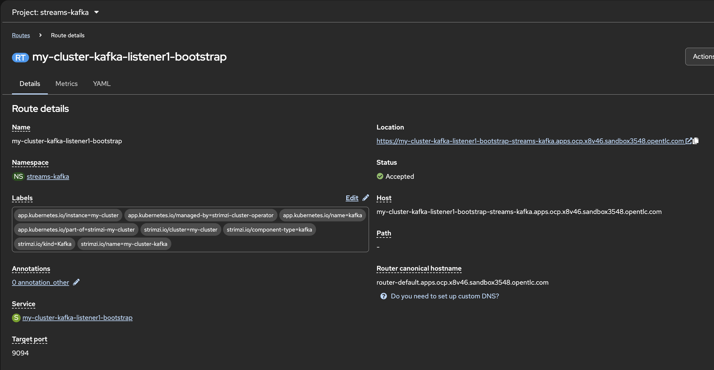 

- Or get Host name with command line
  
  ```ssh
  oc get routes my-cluster-kafka-listener1-bootstrap -o=jsonpath='{.status.ingress[0].host}{"\n"}'
  ```

- For access kafka with OpenShift Route, client must connect via TLS, The ca.crt file contains the public certificate for the Kafka cluster. This certificate is required by external clients to establish a TLS connection.
- Go to `my-cluster`, Resources tab, view `my-cluster-cluster-ca-cert`

  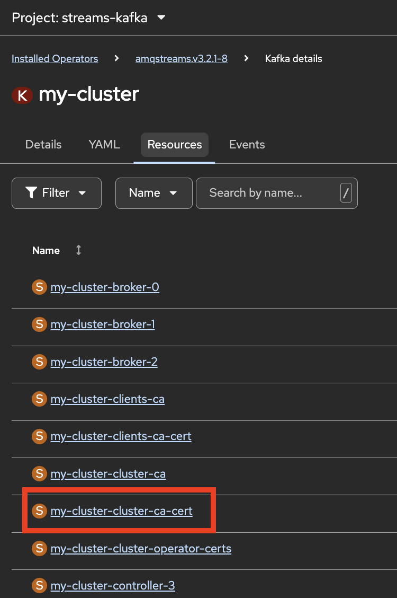 


- Copy the certificate content from the web console or extract it by using the oc command-line tool

  ```ssh
  oc extract secret/my-cluster-cluster-ca-cert --keys=ca.crt --to=- > ca.crt
  ```

- Create a local truststore that contains the public cluster certificate:

  ```ssh
  keytool -keystore client.truststore.jks -alias CARoot -import -file ca.crt
  ```

- When prompted, specify a password for the truststore.
- Configure the Kafka client to use the truststore when connecting to the Kafka cluster. External clients can now connect to the Kafka cluster and start producing and consuming messages.

---

## Create Kafka Topic with YAML (KafkaTopic CRD)

- Back to Topology of project `streams-kafka`
  
  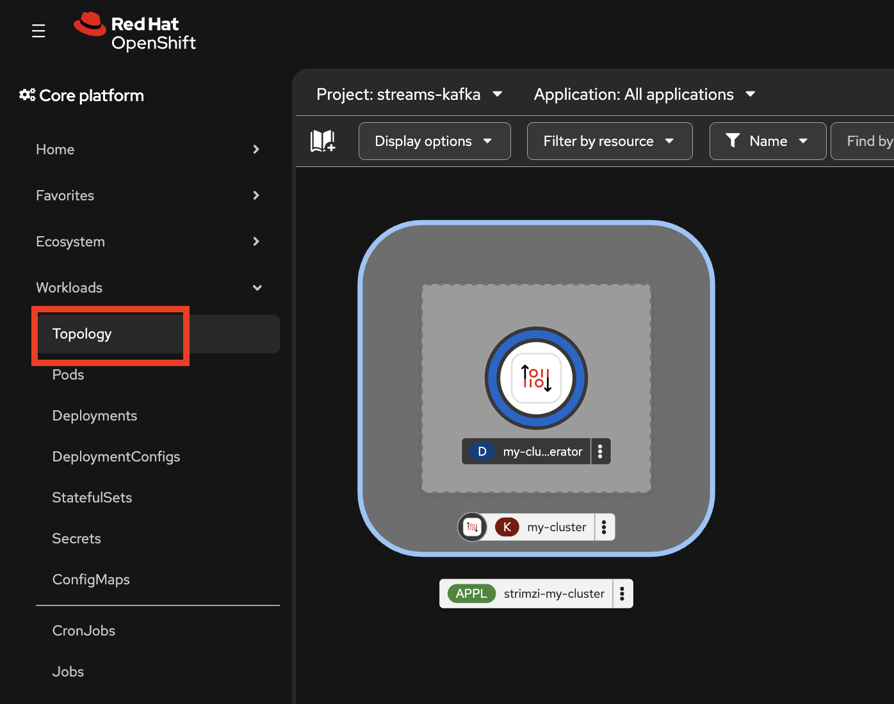 

- Click add to project icon, type `topic`, select Kafka Topic, click Create to create topic from kafka topic CRD.

  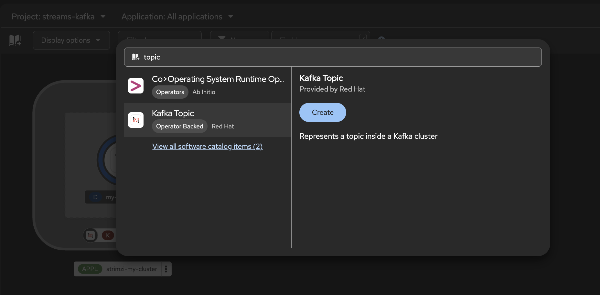 

- Create with below yaml.

  ```yaml

  kind: KafkaTopic
  apiVersion: kafka.strimzi.io/v1
  metadata:
    name: my-topic
    labels:
      strimzi.io/cluster: my-cluster
    namespace: streams-kafka
  spec:
    partitions: 3
    replicas: 3
    config:
      retention.ms: 604800000
      segment.bytes: 1073741824

  ```

- You can check Kafka topic from Kafka Topic tab in Operator.

  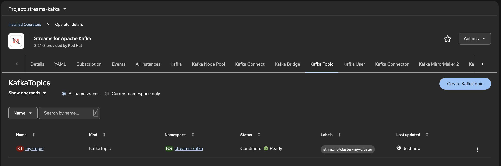

---

## Test Kafka Cluster in OpenShift

- Open Web Terminal (or run from your terminal after login to openshift cluster with `oc login`)

   

- start web terminal

  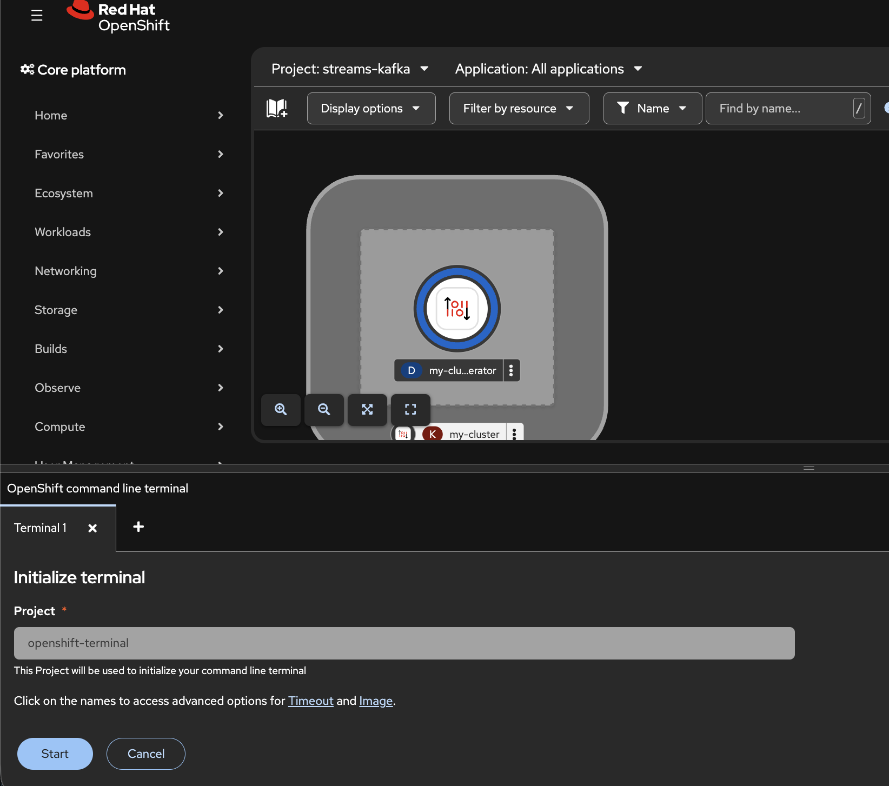 

- Set up the project to the project where the Kafka cluster is installed.

  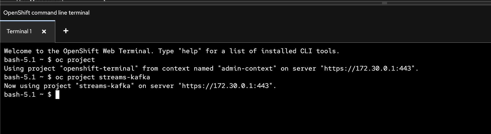   

- run kafka container for test
  
  ```ssh
  oc run kafka-terminal -ti \
  --image=registry.redhat.io/amq-streams/kafka-42-rhel9:3.2.0 \
  --rm=true \
  --restart=Never \
  -- /bin/bash

  ```

- test kafka command such as list topic in kafka cluster

  ```ssh
  ./kafka-topics.sh \
  --bootstrap-server my-cluster-kafka-bootstrap:9092 \
  --list

  ```

- exit from current container with `Ctrl+c`
- Test kafka producer with below command and try to produce data (type data after `>` and type enter)

  ```ssh
  oc run kafka-producer -ti \
  --image=registry.redhat.io/amq-streams/kafka-42-rhel9:3.2.0 \
  --rm=true \
  --restart=Never \
  -- bin/kafka-console-producer.sh \
  --bootstrap-server my-cluster-kafka-bootstrap:9092 \
  --topic my-topic

  ```

  example output

  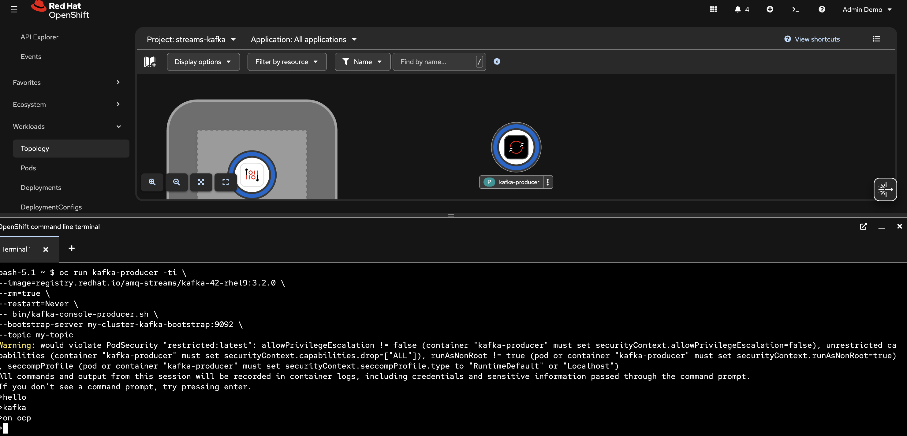  


- Open New Terminal Tab, Test kafka consumer with below command 

  ```ssh
  oc run kafka-consumer -ti \
  --image=registry.redhat.io/amq-streams/kafka-42-rhel9:3.2.0 \
  --rm=true \
  --restart=Never \
  -- bin/kafka-console-consumer.sh \
  --bootstrap-server my-cluster-kafka-bootstrap:9092 \
  --topic my-topic \
  --from-beginning
  ```
  
  example output

  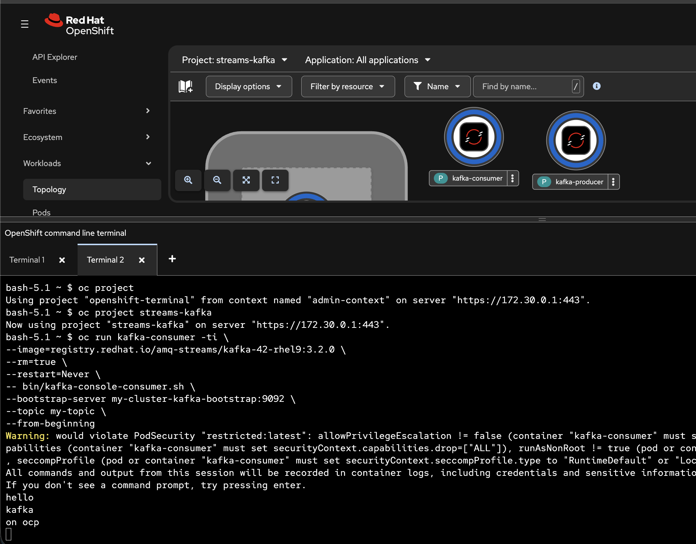     

- Exit from both container with `Ctrl+c`

- Example for kafka producer outside openshift cluster

  ```ssh
  bin/kafka-console-producer.sh \
  --bootstrap-server <route-hostname>:443 \
  --producer-property security.protocol=SSL \
  --producer-property ssl.truststore.location=client.truststore.jks \
  --producer-property ssl.truststore.password=<truststore-password> \
  --topic my-topic
  ```

- Example for kafka consumer outside openshift cluster

  ```ssh
  bin/kafka-console-consumer.sh \
  --bootstrap-server <route-hostname>:443 \
  --consumer-property security.protocol=SSL \
  --consumer-property ssl.truststore.location=client.truststore.jks \
  --consumer-property ssl.truststore.password=<truststore-password> \
  --topic my-topic \
  --from-beginning
  ```


---

## Back to Table of Content

- [Hands-On Lab: Red Hat Streams for Apache Kafka on OpenShift](../README.md)