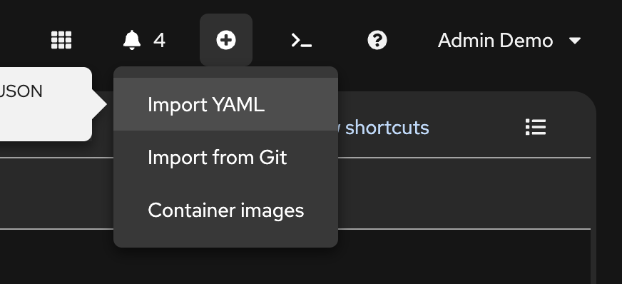
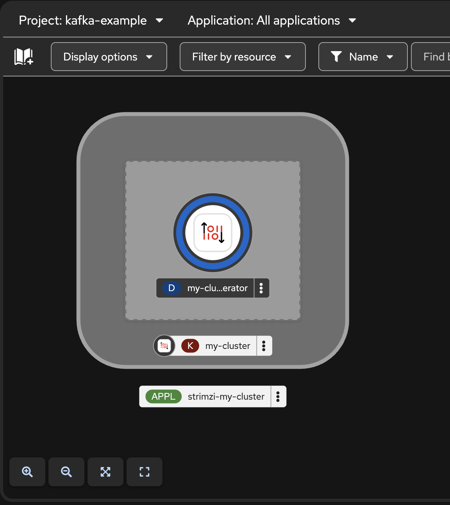
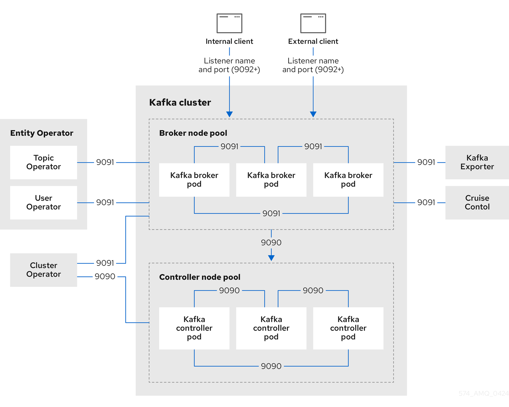
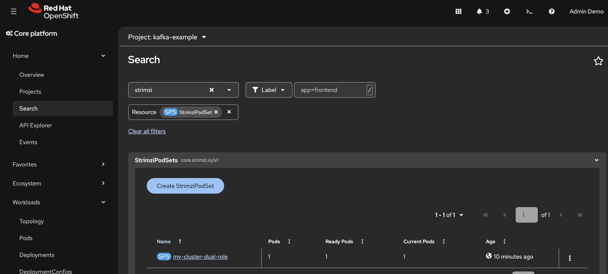
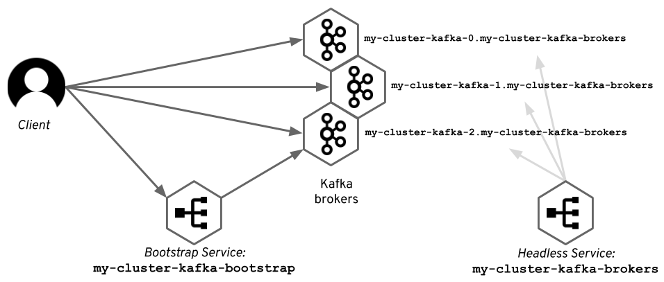
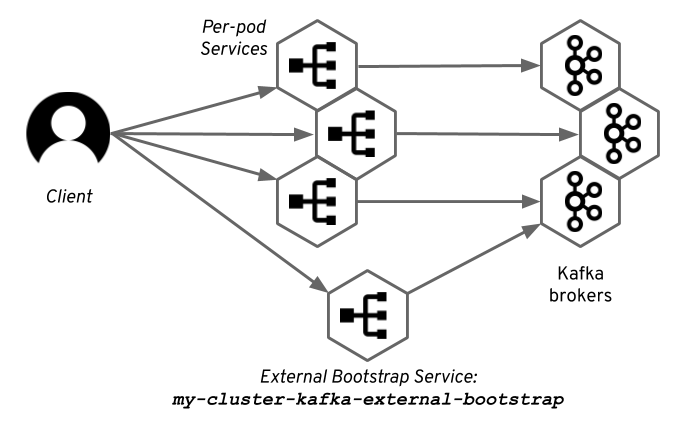
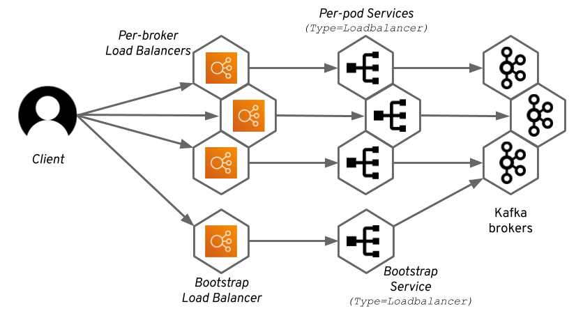
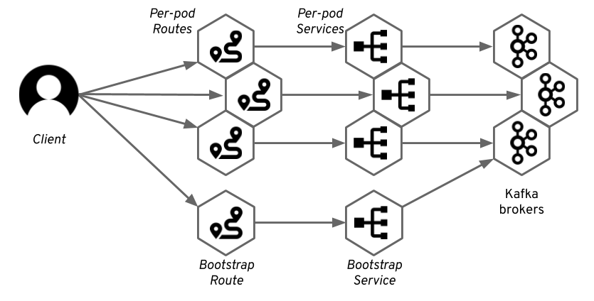

# Configure and manage a Streams for Apache Kafka deployment

> Configure and manage a Streams for Apache Kafka deployment to your precise needs using Streams for Apache Kafka custom resources. Streams for Apache Kafka provides example custom resources with each release, allowing you to configure and create instances of supported Kafka components.


---

- [Configure and manage a Streams for Apache Kafka deployment](#configure-and-manage-a-streams-for-apache-kafka-deployment)
  - [Kafka Example](#kafka-example)
  - [Prevent accidental data loss](#prevent-accidental-data-loss)
  - [Repeat Kafka Cluster](#repeat-kafka-cluster)
  - [Setting up client access to a Kafka cluster](#setting-up-client-access-to-a-kafka-cluster)
  - [](#)
  - [Back to Table of Content](#back-to-table-of-content)

---

## Kafka Example

The examples in this module demonstrate how you can use Kraft (ZooKeeper-less Apache Kafka) with Streams for Apache Kafka.

* The [`kafka-single-node.yaml`](../manifests/examples/kafka/kafka-single-node.yaml) deploys a Kafka cluster with a single Kafka node that has both _broker_ and _controller_ roles.
* The [`kafka-with-dual-role-nodes.yaml`](../manifests/examples/kafka/kafka-with-dual-role-nodes.yaml) deploys a Kafka cluster with one pool of KRaft nodes that share the _broker_ and _controller_ roles.
* The [`kafka-jbod.yaml`](../manifests/examples/kafka/kafka-jbod.yaml) deploys a Kafka cluster with one pool of _KRaft controller_ nodes and one pool of _KRaft broker_ nodes with multi-volumes (jbod).
  
- Create Openshift Project : `kafka-example`
- open web terminal, change to project : `kafka-example`
- clear previous deployment 
  
  ```ssh
  oc delete Kafka,KafkaNodePool --all

  ```

- Open Import YAML
  
  

- Copy & Paste yaml from [`kafka-single-node.yaml`](../manifests/examples/kafka/kafka-single-node.yaml) 
- Click Create
- Wait until cluster complete!

  

- Review Topology, Pods, Services, PV, PVC
- For more detail about kafka configuration see **[Configuring Kafka](https://docs.redhat.com/en/documentation/red_hat_streams_for_apache_kafka/3.2/html/deploying_and_managing_streams_for_apache_kafka_on_openshift/overview-str#con-config-kafka-kraft-str)**
- For more detail about kafka nodepool see **[Configuring Node Pools](https://docs.redhat.com/en/documentation/red_hat_streams_for_apache_kafka/3.2/html/deploying_and_managing_streams_for_apache_kafka_on_openshift/overview-str#config-node-pools-str)**

- Example Kafa Cluster Topology on OpenShift
  
  

- Search `strimzipodset` in search menu
  
  

- or use oc command in your terminal

  ```ssh
  oc get Kafka,KafkaNodePool,Pod

  ```

- Delete kafka cluster, go to web terminal, 

  ```ssh
  oc delete Kafka,KafkaNodePool --all

  ```

- Recheck kafka resources again! 

## Prevent accidental data loss

- That behavior is by design to prevent accidental data loss. Strimzi explicitly leaves Persistent Volume Claims (PVCs) behind when a `Kafka` resource is deleted, and OpenShift's underlying `StorageClass` often defaults to a `Retain` policy.

- **Automate PVC Deletion in the Kafka CR**
To make Strimzi delete PVCs automatically whenever you delete the cluster, set `deleteClaim: true` inside your `Kafka` spec:

  ```yaml
  storage:
    type: jbod
    volumes:
      - id: 0
        type: persistent-claim       
        size: 100Gi
        deleteClaim: true

  ```

- For More detail of kafka storage see **[Configuring Kafka Storage](https://docs.redhat.com/en/documentation/red_hat_streams_for_apache_kafka/3.2/html/deploying_and_managing_streams_for_apache_kafka_on_openshift/overview-str#assembly-storage-str)**

- **Clean Up Existing Orphaned Storage**
If you already deleted the `Kafka` CR without `deleteClaim: true`, clean up the storage manually:

  - Delete remaining PVCs in the namespace:

    ```bash
    oc delete pvc -l strimzi.io/cluster=<cluster-name> -n <namespace>

    ```
  - Purge orphaned PVs (if StorageClass uses `reclaimPolicy: Retain`):
Deleting the PVC may leave the Persistent Volume (PV) stuck in a `Released` state instead of freeing the disk. Run these commands to identify and remove them:

    ```bash
    # List PVs filtered by Released status
    oc get pv | grep Released

    # Delete the orphaned PV to free storage on the backend array/provider
    oc delete pv <pv-name>

    ```

---

## Repeat Kafka Cluster

- repeat again with The [`kafka-with-dual-role-nodes.yaml`](../manifests/examples/kafka/kafka-with-dual-role-nodes.yaml) and The [`kafka-jbod.yaml`](../manifests/examples/kafka/kafka-jbod.yaml) .

---

## Setting up client access to a Kafka cluster

- [Configuring listeners to connect to Kafka](https://docs.redhat.com/en/documentation/red_hat_streams_for_apache_kafka/3.2/html-single/deploying_and_managing_streams_for_apache_kafka_on_openshift/index#configuration-points-listeners-str) 

- [Accessing Apache Kafka in Strimzi](https://developers.redhat.com/blog/2019/06/06/accessing-apache-kafka-in-strimzi-part-1-introduction?p=601077)

- Internal access
  
  

- External access with NodePort

  

- External access with Loadbalancer
  
  

- External access with OpenShift Route
  
  

- External access with Ingress

  
---

## Back to Table of Content

- [Hands-On Lab: Red Hat Streams for Apache Kafka on OpenShift](../README.md)