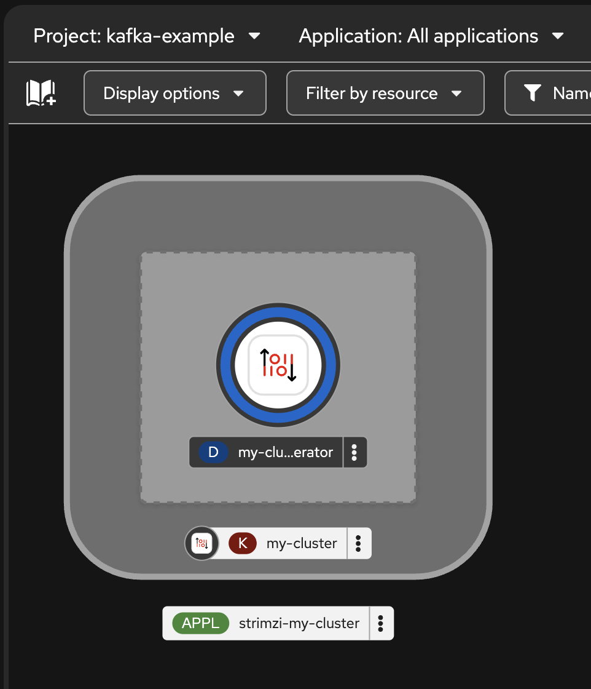
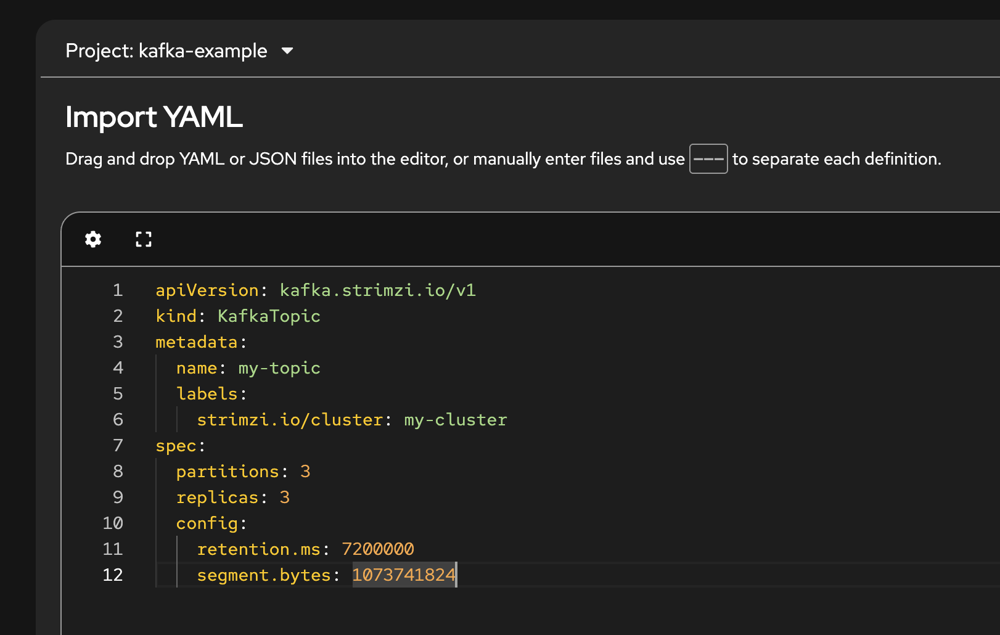
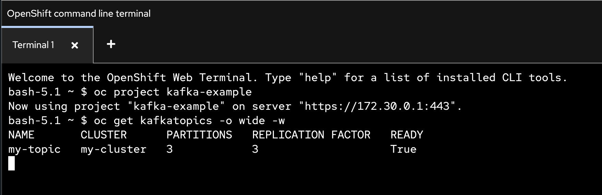
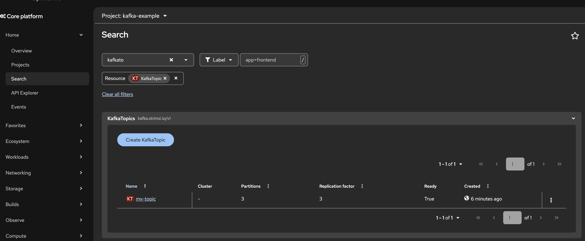
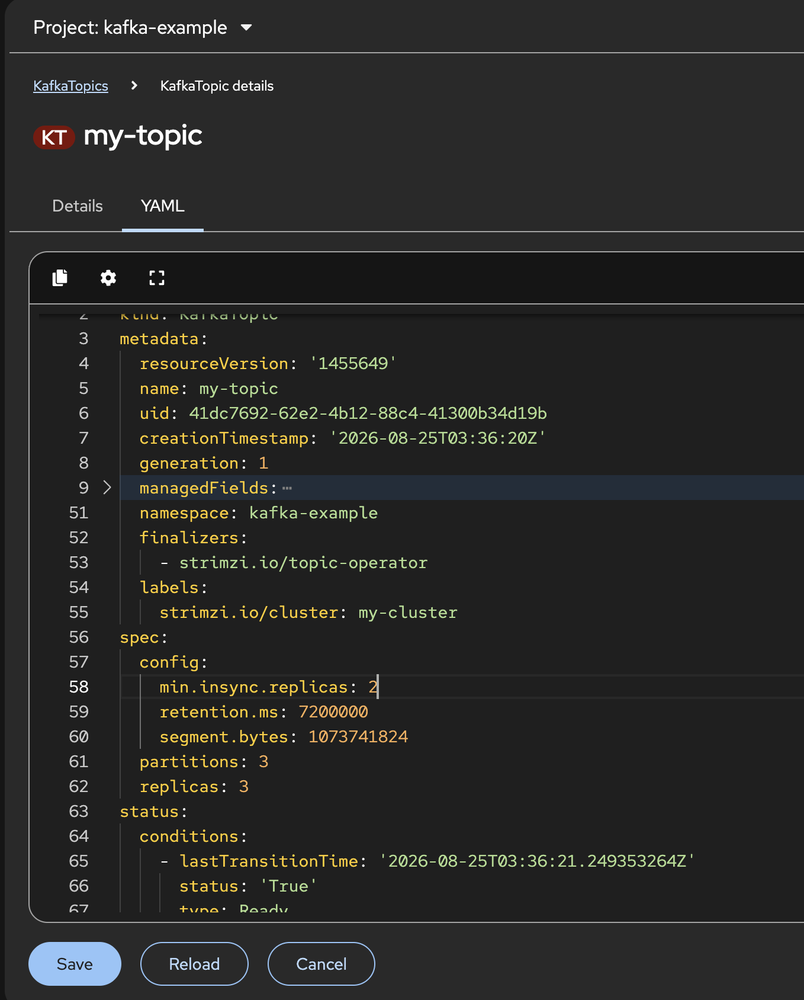
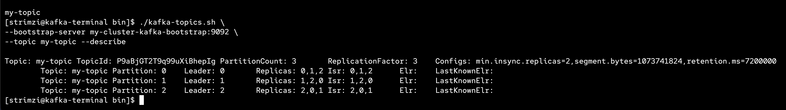

# Kafka Topic

> The KafkaTopic resource configures topics, including partition and replication factor settings. When you create, modify, or delete a topic using KafkaTopic, the Topic Operator ensures that these changes are reflected in the Kafka cluster.

- [Kafka Topic](#kafka-topic)
  - [KafkaTopic](#kafkatopic)
  - [Schema Reference](#schema-reference)
  - [Back to Table of Content](#back-to-table-of-content)

---

## KafkaTopic

- In Project `kafka-example`
- Clear all previous kafka cluster.
- Create  The [`kafka-persistent.yaml`](../manifests/examples/kafka/kafka-persistent.yaml) deploys a Kafka cluster with one pool of _KRaft controller_ nodes and one pool of _KRaft broker_ nodes.
- Wait until kafka cluster complete!
  
  

- Create KafkaTopic, use Import Yaml, copy and paste yaml from [`kafka-topic.yaml`](../manifests/examples/topic/kafka-topic.yaml)

  


- **The KafkaTopic resource** is responsible for managing a single topic within a Kafka cluster.

  The Topic Operator operates as follows:

  When a KafkaTopic is created, deleted, or changed, the Topic Operator performs the corresponding operation on the Kafka topic.
  
  If a topic is created, deleted, or modified directly within the Kafka cluster, without the presence of a corresponding KafkaTopic resource, the Topic Operator does not manage that topic. The Topic Operator will only manage Kafka topics associated with KafkaTopic resources and does not interfere with topics managed independently within the Kafka cluster. If a KafkaTopic does exist for a Kafka topic, any configuration changes made outside the resource are reverted.

- For more detail about kafka topic see **[Configuring Kafka Topic](https://docs.redhat.com/en/documentation/red_hat_streams_for_apache_kafka/3.2/html/deploying_and_managing_streams_for_apache_kafka_on_openshift/using-the-topic-operator-str#ref-operator-topic-str)**

- Wait for the ready status of the topic to change to True:

  ```ssh
  oc get kafkatopics -o wide -w -n <namespace>
  ```
 
  example output

  

- try to edit kafka topic config, add min.insync.replica
  
  ```yaml
  spec:
    partitions: 3
    replicas: 3 
    config:
      min.insync.replicas: 2
  #...
  ```

  example to edit, search `kafkatopic`

  

  edit yaml

  

- Check topic in kafka, run kafka container for test
  
  ```ssh
  oc run kafka-terminal -ti \
  --image=registry.redhat.io/amq-streams/kafka-42-rhel9:3.2.0 \
  --rm=true \
  --restart=Never \
  -- /bin/bash

  ```

- test kafka command such as list topic in kafka cluster

  ```ssh
  ./kafka-topics.sh \
  --bootstrap-server my-cluster-kafka-bootstrap:9092 \
  --list

  ```

- descripbe kafka topic `my-topic`

  ```ssh
  ./kafka-topics.sh \
  --bootstrap-server my-cluster-kafka-bootstrap:9092 \
  --topic my-topic --describe

  ```

  example output

  

- **ELR and LastKnownELF** In Apache Kafka (introduced via KIP-966 for KRaft), ELR (Eligible Leader Replicas) and LastKnownELR are partition metadata features designed to improve High Availability (HA) and prevent partition downtime without risking extreme data loss.

  Core Concepts

  - ISR (In-Sync Replicas): The primary candidate set. These replicas are 100% caught up with the active leader.

  - ELR (Eligible Leader Replicas): The secondary candidate set. These are replicas that recently dropped out of the ISR (e.g., due to transient network lag or brief restarts), but still hold nearly up-to-date data. If all ISR replicas fail, Kafka can safely promote an ELR replica to leader to keep the partition online while minimizing data loss.

  - LastKnownELR (Last Known Eligible Leader Replicas): The disaster-recovery tracking list. In catastrophic scenarios where all ISR and ELR replicas crash simultaneously, Kafka records the last known state of healthy replicas. When brokers begin recovering, the controller waits for a broker from LastKnownELR to come online before electing it as leader, ensuring data integrity.

  Leader Election Fallback Hierarchy

  1. Select from ISR: Standard clean leader election (zero data loss).

  2. Select from ELR: Promotes a near-up-to-date replica if all ISR members are lost, preventing partition downtime.

  3. Wait for LastKnownELR: On total partition failure, waits specifically for a previously safe broker to reboot.

  4. Unclean Leader Election: The absolute last resort (if enabled), which promotes any surviving replica regardless of how outdated its data is.

  Key Benefit

  These features solve the traditional trade-off between strict data safety (unclean.leader.election.enable=false, which risks complete partition unavailability) and high availability (unclean.leader.election.enable=true, which risks severe data loss).

- exit from `kafka-terminal`

- **Tip : How to convert Kafka topics that are currently managed through the KafkaTopic resource into unmanaged topics** By annotating a KafkaTopic resource with strimzi.io/managed=false, you indicate that the Topic Operator should no longer manage that particular topic. This allows you to retain the Kafka topic while making changes to the resource’s configuration or other administrative tasks.

  ```ssh
  oc annotate kafkatopic my-topic-1 strimzi.io/managed="false" --overwrite
  ```

  or

  ```yaml
  apiVersion: kafka.strimzi.io/v1
  kind: KafkaTopic
  metadata:
    generation: 124
    name: my-topic-1
    finalizer:
    - strimzi.io/topic-operator
    labels:
      strimzi.io/cluster: my-cluster
    annotations:
      strimzi.io/managed: "false" #set manage to false
  spec:
    partitions: 10
    replicas: 2
  #...  
  ```

---

## Schema Reference

For more information on the Kafka resource, see the [Schema reference](https://docs.redhat.com/en/documentation/red_hat_streams_for_apache_kafka/3.2/html-single/streams_for_apache_kafka_api_reference/index).


---

## Back to Table of Content

- [Hands-On Lab: Red Hat Streams for Apache Kafka on OpenShift](../README.md)