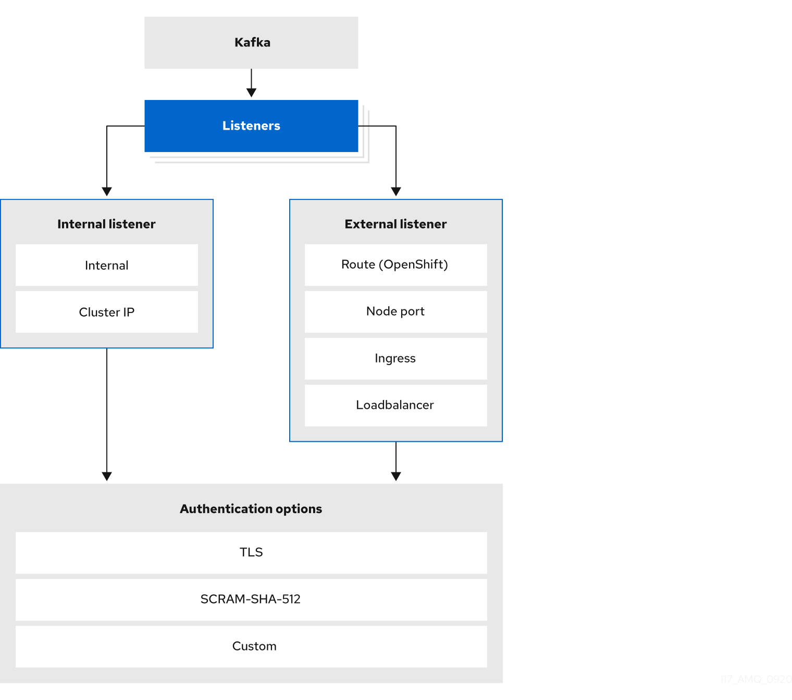
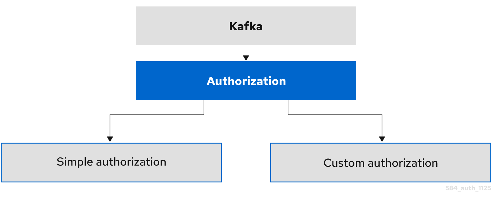
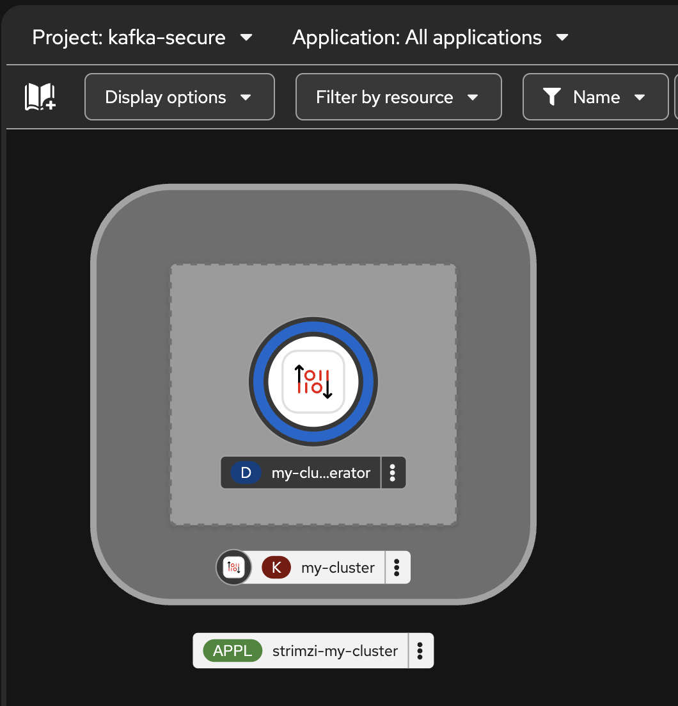
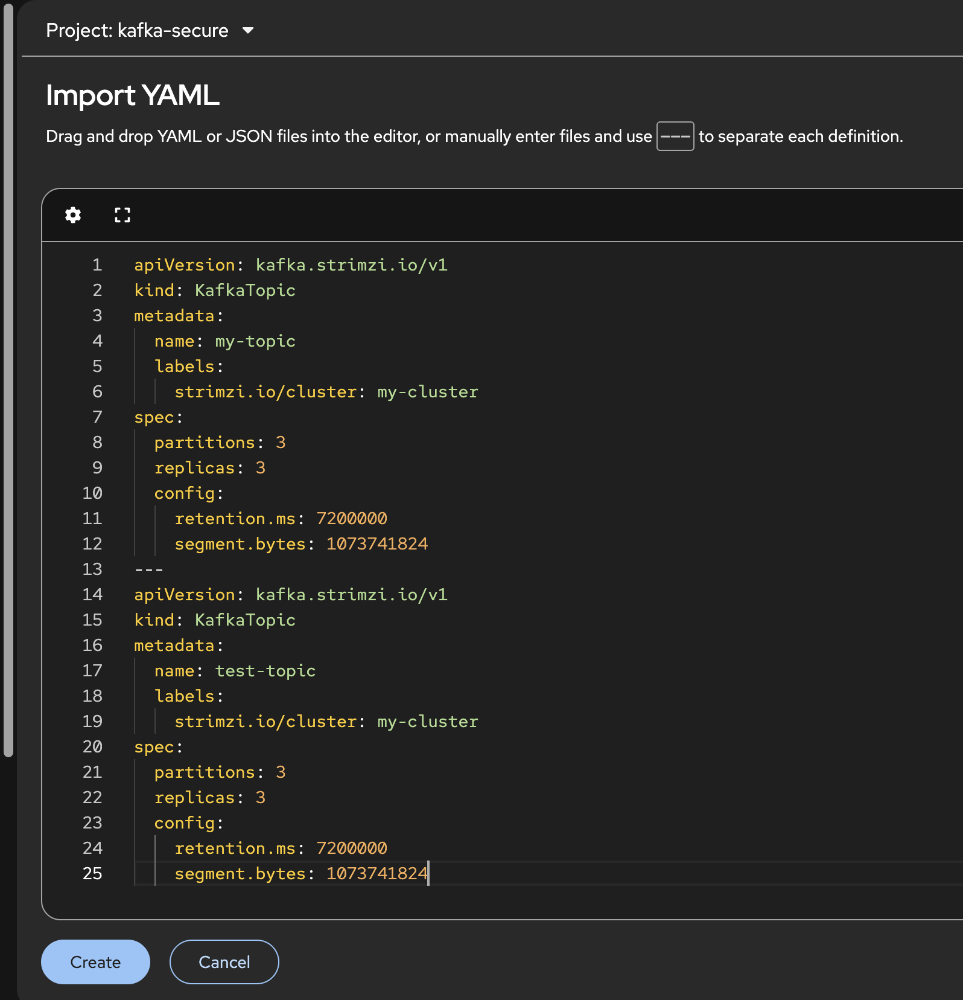
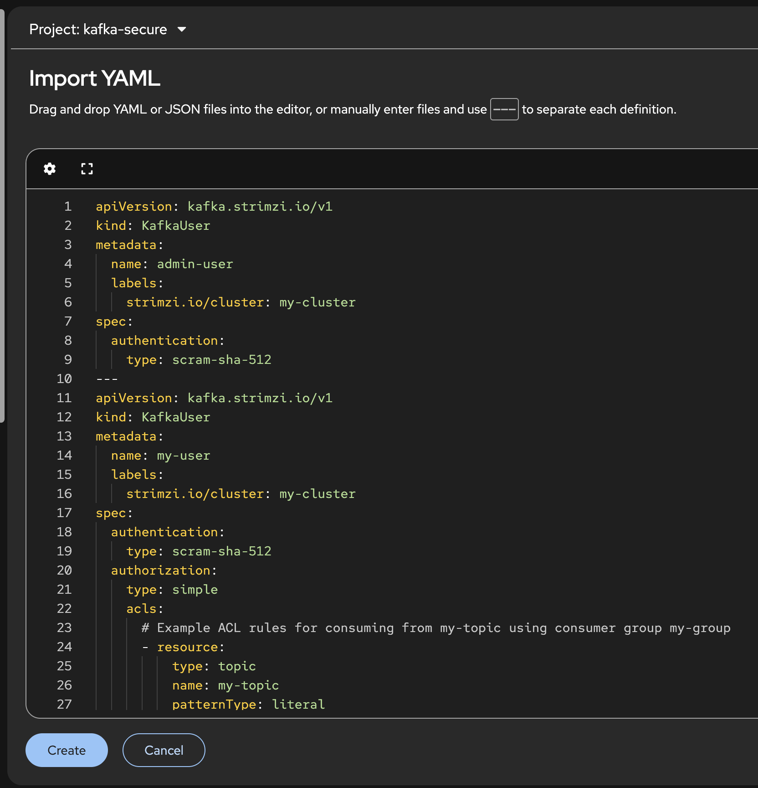
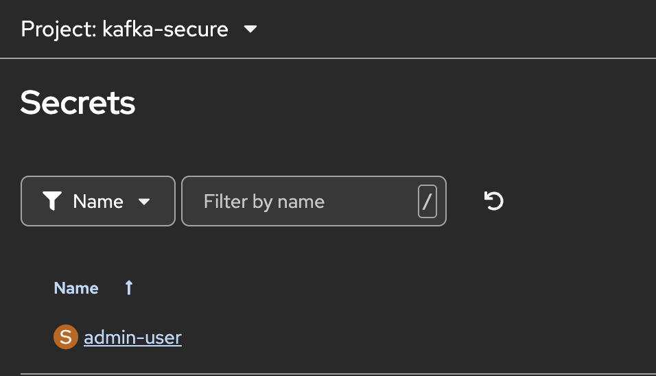
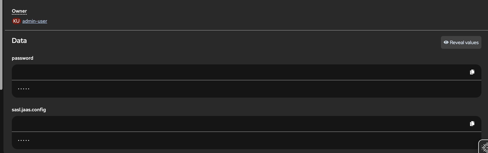
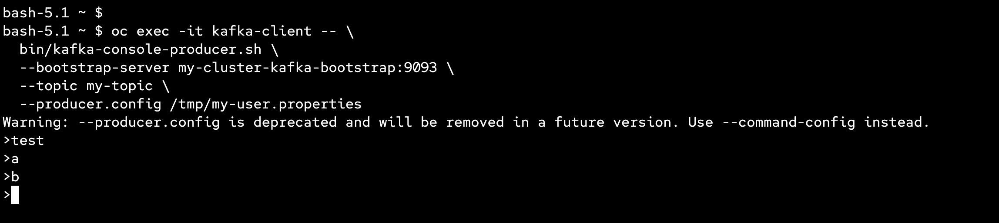
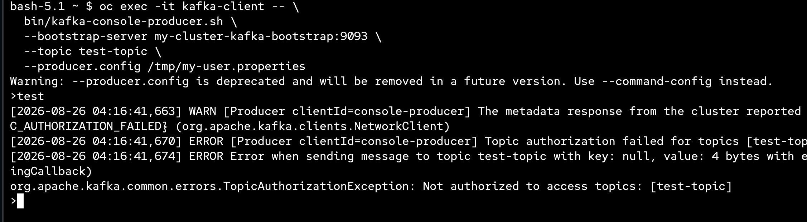
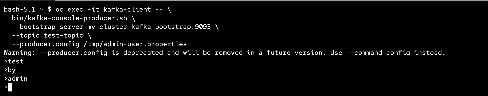

# Securing access to a Kafka cluster

> Secure connections by configuring Kafka and Kafka users. Through configuration, you can implement encryption, authentication, and authorization mechanisms.

- [Securing access to a Kafka cluster](#securing-access-to-a-kafka-cluster)
  - [How to secure access to a Kafka Cluster](#how-to-secure-access-to-a-kafka-cluster)
  - [Securing access to a Kafka cluster with SCRAM-SHA-512 Example](#securing-access-to-a-kafka-cluster-with-scram-sha-512-example)
  - [Test Kafka User](#test-kafka-user)
  - [Reference](#reference)
  - [Back to Table of Content](#back-to-table-of-content)

---

## How to secure access to a Kafka Cluster

- [[Configuring authentication access to Kafka](https://docs.redhat.com/en/documentation/red_hat_streams_for_apache_kafka/3.2/html-single/deploying_and_managing_streams_for_apache_kafka_on_openshift/index#con-securing-kafka-authentication-str)

  

- [Configuring authorized access to Kafka](https://docs.redhat.com/en/documentation/red_hat_streams_for_apache_kafka/3.2/html-single/deploying_and_managing_streams_for_apache_kafka_on_openshift/index#con-securing-kafka-authorization-str)

  

- **Note:** The Strimzi Cluster Operator automatically provisions and manages all internal communication between Kafka brokers and KRaft controllers.

  What Strimzi Handles Automatically

  - Internal Listeners & Ports: Automatically creates dedicated internal listeners (e.g., port 9090 for the KRaft control plane and ports 9091/9093 for inter-broker traffic).

  - mTLS Encryption: Automatically issues, applies, and rotates TLS certificates using the internal Cluster CA to enforce mutual TLS (mTLS) for all internal node communication.

  - Service Discovery: Generates Kubernetes/OpenShift Headless Services to allow nodes to locate each other via internal DNS automatically.

---

## Securing access to a Kafka cluster with SCRAM-SHA-512 Example

- New project `kafka-secure`

- Review [kafka.yaml](../manifests/examples/security/scram-sha-512-auth/kafka.yaml), check authentication and authorization
  
  ```yaml
  apiVersion: kafka.strimzi.io/v1
  kind: Kafka
  metadata:
    name: my-cluster
  spec:
    kafka:
      version: 4.2.0
      metadataVersion: 4.2-IV1
      listeners:
        - name: tls
          port: 9093
          type: internal
          tls: true
          authentication: # add authenticatio per listener
            type: scram-sha-512
      authorization: # add authorization per cluster
        type: simple
        superUsers:              # add super user
          - admin-user
      config:
  #..
  ```

- Create new Kafka Cluster with [kafka.yaml](../manifests/examples/security/scram-sha-512-auth/kafka.yaml)

- wait until complete

  

- Review 2 topic (`my-topic` and `test-topic`) from [topic.yaml](../manifests/examples/security/scram-sha-512-auth/topic.yaml)

- Create 2 topic from [topic.yaml](../manifests/examples/security/scram-sha-512-auth/topic.yaml)

  

- Wait for the ready status of the topic to change to True:

  ```ssh
  oc get kafkatopics -o wide -w -n <namespace>
  ```

- Review `admin-user` and `my-user` in [user.yaml](../manifests/examples/security/scram-sha-512-auth/user.yaml)

- Create Kafka user for access from [user.yaml](../manifests/examples/security/scram-sha-512-auth/user.yaml)
 
  

- Review Secret from Kafka User (`admin-user` and `my-user`)

  

- View password and sasl.jass.config data in secret object

  

- Example command to view password encoding

  ```ssh
  echo "Z2VuZXJhdGVkcGFzc3dvcmQ=" | base64 --decode
  ```

---

## Test Kafka User

- Open Terminal, create kafka pod `kafka-test`
  
  ```ssh
  oc run kafka-client \
    --image=registry.redhat.io/amq-streams/kafka-42-rhel9:3.2.0 \
    --restart=Never \
    -- sleep infinity

  oc wait pod/kafka-client --for=condition=Ready --timeout=60s
  ```

- Retrieve the truststore password (PKCS12) generated by the operator.

  ```ssh
  oc get secret my-cluster-cluster-ca-cert \
    -o jsonpath='{.data.ca\.password}' | base64 -d
  ```

- Retrieve user password (SCRAM-SHA-512) from `my-user` and `admin-user`
  
  ```ssh 
  oc get secret my-user \
    -o jsonpath='{.data.password}' | base64 -d

  oc get secret admin-user \
    -o jsonpath='{.data.password}' | base64 -d
  ```

- Extract the truststore.p12 file from kafka cluster

  ```ssh
  oc extract secret/my-cluster-cluster-ca-cert \
    --keys=ca.p12 --to=- > /tmp/truststore.p12
  ```

- Copy kafka cluster truststore to kafka client pod

  ```ssh
  oc cp /tmp/truststore.p12 kafka-client:/tmp/truststore.p12
  ```

- Create client.properties for kafka client (my-user.properties for `my-user`, admin-user.properties for `admin-user`)

  my-user.properties

  ```ssh
  oc exec -it kafka-client -- bash -c '
  cat > /tmp/my-user.properties << EOF
  security.protocol=SASL_SSL
  sasl.mechanism=SCRAM-SHA-512
  sasl.jaas.config=org.apache.kafka.common.security.scram.ScramLoginModule required \
    username="my-user" \
    password="<REPLACE_WITH_USER_PASSWORD>";
  ssl.truststore.location=/tmp/truststore.p12
  ssl.truststore.password=<REPLACE_WITH_TRUSTSTORE_PASSWORD>
  ssl.truststore.type=PKCS12
  EOF
  '
  ```

  admin-user.properties

  ```ssh
  oc exec -it kafka-client -- bash -c '
  cat > /tmp/admin-user.properties << EOF
  security.protocol=SASL_SSL
  sasl.mechanism=SCRAM-SHA-512
  sasl.jaas.config=org.apache.kafka.common.security.scram.ScramLoginModule required \
    username="admin-user" \
    password="<REPLACE_WITH_USER_PASSWORD>";
  ssl.truststore.location=/tmp/truststore.p12
  ssl.truststore.password=<REPLACE_WITH_TRUSTSTORE_PASSWORD>
  ssl.truststore.type=PKCS12
  EOF
  '
  ```

- Test produce message in `my-topic` with `my-user`

  ```ssh
  oc exec -it kafka-client -- \
    bin/kafka-console-producer.sh \
    --bootstrap-server my-cluster-kafka-bootstrap:9093 \
    --topic my-topic \
    --producer.config /tmp/my-user.properties
  ```
  
  

- Test produce message in `test-topic` with `my-user` (Check Error : Not authorized to access topics!!!)

  ```ssh
  oc exec -it kafka-client -- \
    bin/kafka-console-producer.sh \
    --bootstrap-server my-cluster-kafka-bootstrap:9093 \
    --topic test-topic \
    --producer.config /tmp/my-user.properties
  ```

  

- Test produce message in `test-topic` with `admin-user`

  ```ssh  
  oc exec -it kafka-client -- \
    bin/kafka-console-producer.sh \
    --bootstrap-server my-cluster-kafka-bootstrap:9093 \
    --topic test-topic \
    --producer.config /tmp/admin-user.properties
  ```

  

---

## Reference

- Keycloak Authorization Example in [keycloak-authorization](../manifests/examples/security/keycloak-authorization/)

- TLS Authentication in [](../manifests/examples/security/tls-auth/)

- For more information on the Kafka resource, see the [Schema reference](https://docs.redhat.com/en/documentation/red_hat_streams_for_apache_kafka/3.2/html-single/streams_for_apache_kafka_api_reference/index).

- [Restricting access to listeners with network policies](https://docs.redhat.com/en/documentation/red_hat_streams_for_apache_kafka/3.2/html-single/deploying_and_managing_streams_for_apache_kafka_on_openshift/index#proc-restricting-access-to-listeners-using-network-policies-str)

- [Using custom listener certificates for TLS encryption](https://docs.redhat.com/en/documentation/red_hat_streams_for_apache_kafka/3.2/html-single/deploying_and_managing_streams_for_apache_kafka_on_openshift/index#proc-installing-certs-per-listener-str)

---

## Back to Table of Content

- [Hands-On Lab: Red Hat Streams for Apache Kafka on OpenShift](../README.md)