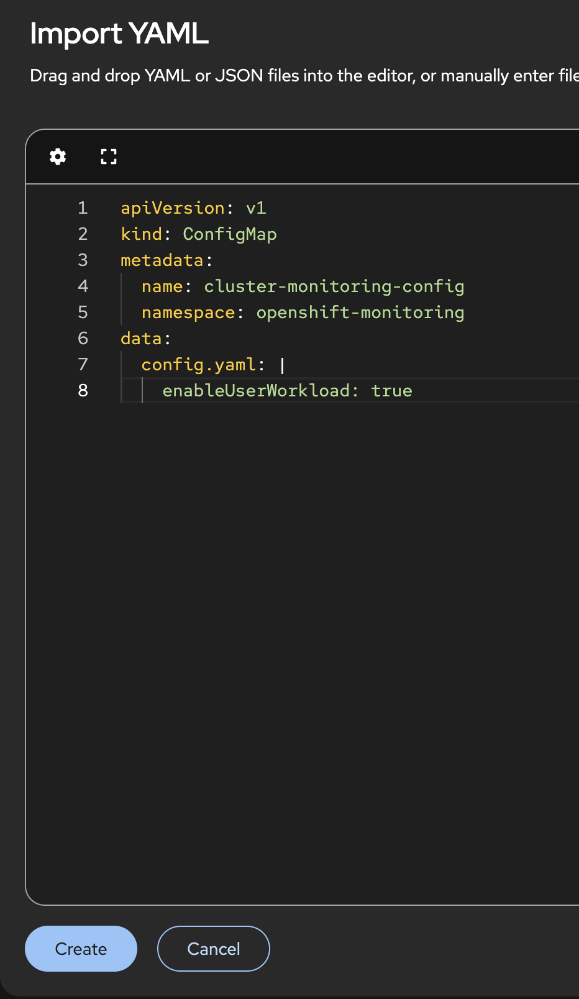
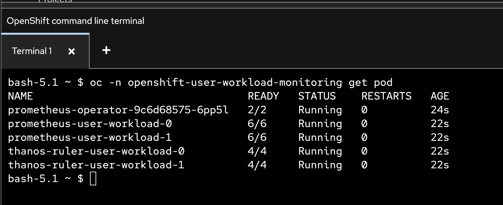
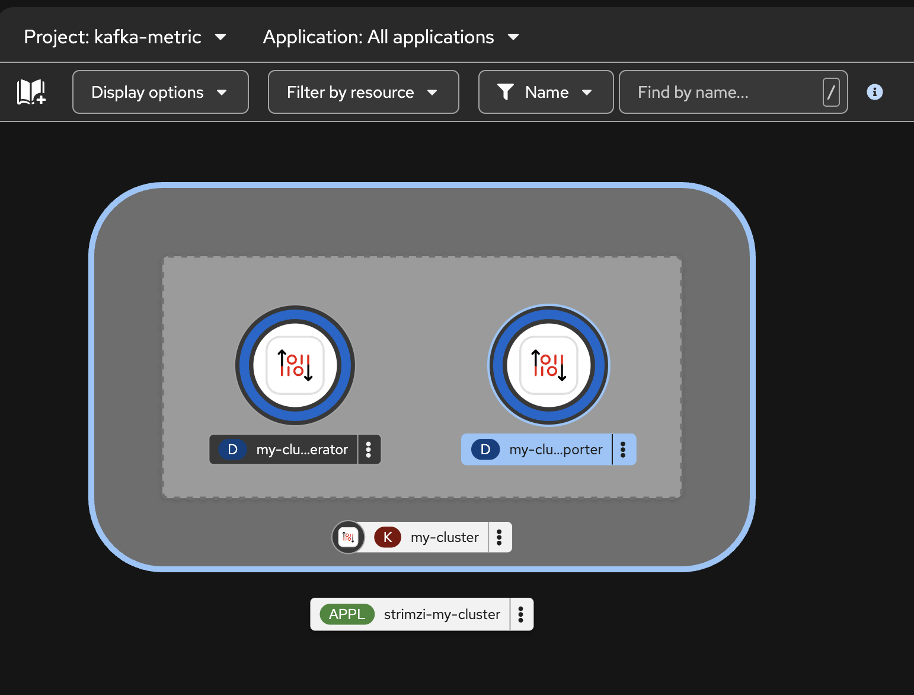
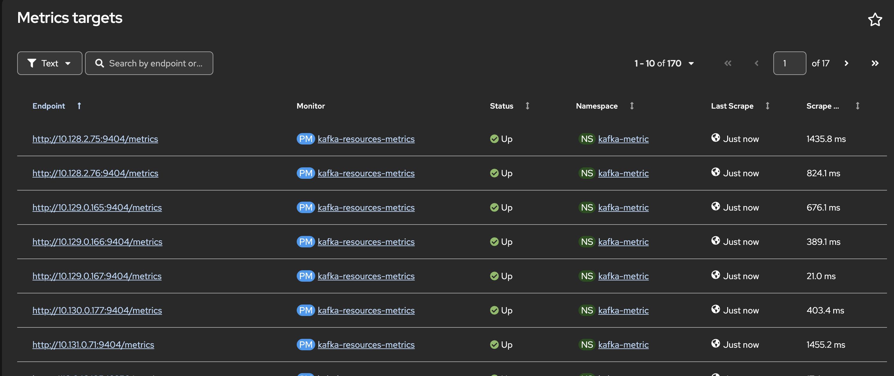
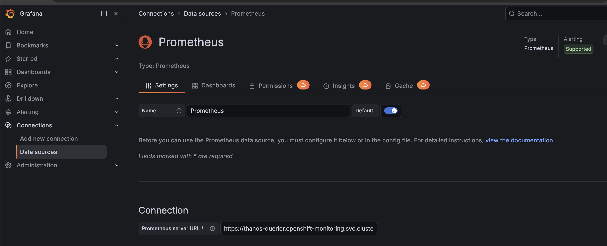
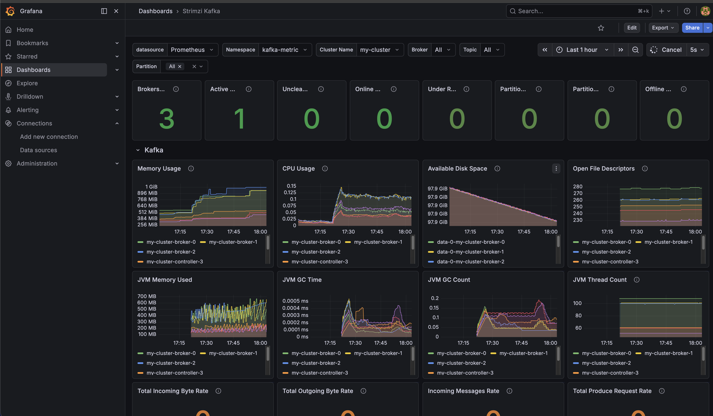
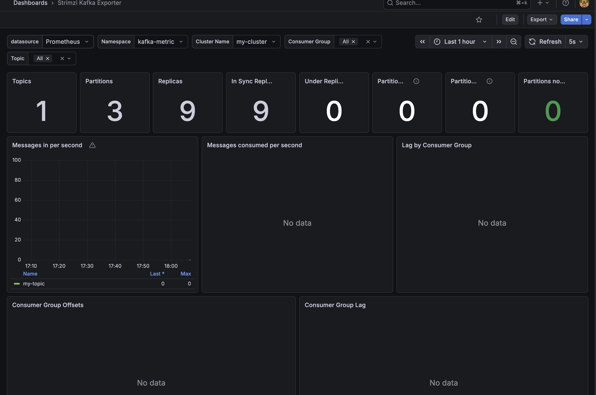
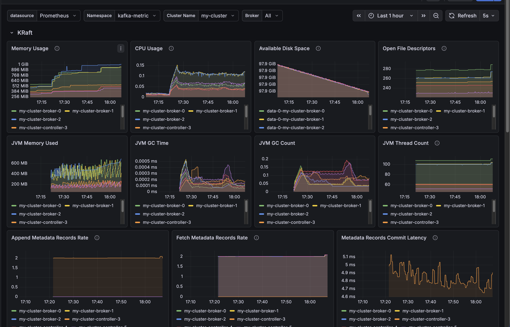
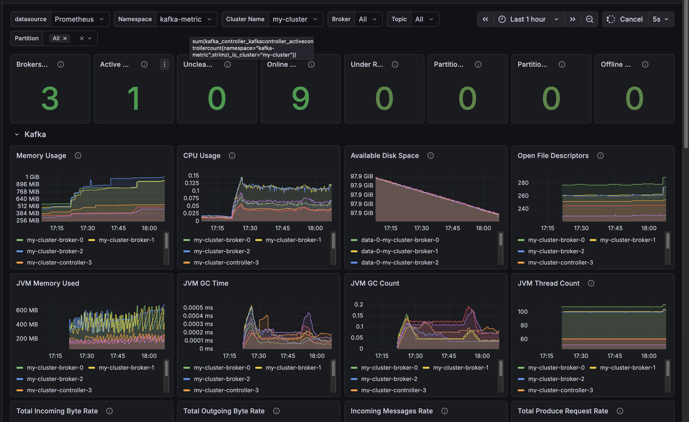

# Kafka Monitoring

> Metrics provide insight into the health, performance, and capacity of your Kafka deployment. By observing these metrics, you can detect potential issues early, optimize resource usage, and improve reliability. 

- [Kafka Monitoring](#kafka-monitoring)
  - [Enable OpenShift User Workload Monitoring](#enable-openshift-user-workload-monitoring)
  - [Create Kafka with Metrics](#create-kafka-with-metrics)
  - [Viewing Kafka metrics and dashboards in OpenShift](#viewing-kafka-metrics-and-dashboards-in-openshift)
  - [Reference](#reference)
  - [Back to Table of Content](#back-to-table-of-content)

---

## Enable OpenShift User Workload Monitoring

- Create configmap to enable user workload monitoring

  ```yaml
  apiVersion: v1
  kind: ConfigMap
  metadata:
    name: cluster-monitoring-config
    namespace: openshift-monitoring
  data:
    config.yaml: |
      enableUserWorkload: true

  ```

  example output

  

- Check user workload monitoring deployment with below command

  ```ssh
  oc -n openshift-user-workload-monitoring get pod
  ```

  example output

  

---

## Create Kafka with Metrics

- Create project : `kafka-metric`
  
- Review kafka cluster with metric configuration from [kafka-metrics.yaml](../manifests/examples/metrics/kafka-metrics.yaml)

  ```yaml
  apiVersion: kafka.strimzi.io/v1
  kind: Kafka
  metadata:
    name: my-cluster
  spec:
    kafka:
      version: 4.2.0
      metadataVersion: 4.2-IV1
      listeners:
        - name: plain
          port: 9092
          type: internal
          tls: false
        - name: tls
          port: 9093
          type: internal
          tls: true
      config:
        offsets.topic.replication.factor: 3
        transaction.state.log.replication.factor: 3
        transaction.state.log.min.isr: 2
        default.replication.factor: 3
        min.insync.replicas: 2
      metricsConfig: #--> add metrics configuration
        type: jmxPrometheusExporter
        valueFrom:
          configMapKeyRef:
            name: kafka-metrics
            key: kafka-metrics-config.yml #--> config map metrics
    entityOperator:
      topicOperator: {}
      userOperator: {}
    kafkaExporter: #--> add kafka exporter
      topicRegex: ".*"
      groupRegex: ".*"
  ```

- Create Kafka Cluster with Kafka Exporter and Prometheus JMX Exporter from [kafka-metrics.yaml](../manifests/examples/metrics/kafka-metrics.yaml)

  


- Create Topic `my-topic` from [kafka-topic.yaml](../manifests/examples/topic/kafka-topic.yaml)
  
---

##  Viewing Kafka metrics and dashboards in OpenShift 

- Create PodMonitor for scrap metric to UWM [kafka-resource-metrics.yaml](../manifests/examples/metrics/prometheus-install/pod-monitors/kafka-resources-metrics.yaml)

- Edit namespace/project in `kafka-resrouce-metrics.yaml` before create podmonitor

  ```yaml
  #...
  namespaceSelector:
    matchNames:
      - kafka-metric # change thisto your projectanme
  #...
  ``` 

- Review Metrics targets in Observe>Targets

  

- Create a ServiceAccount for Grafana

  ```ssh
  oc create sa grafana-service-account -n kafka-metric
  ``` 

- Create ClusterRoleBinding and Secret for previous service account from [ClusterRoleBinding.yaml](../manifests/examples/metrics/ClusterRoleBinding.yaml)

- Get the access token of the Grafana ServiceAccount

  ```ssh
  oc describe secret secret-sa | grep token:
  ```

  example output
  
  ```ssh
  eyJhbGciOiJSUzI1NiIsImtpZCI6IlkzY0RPZnZrQ05UMVZIVW83Zk5yM1Vra0xMSUpYYVdueGVkYWNLQloyVkEifQ.eyJpc3MiOiJrdWJlcm5ldGVzL3NlcnZpY2VhY2NvdW50Iiwia3ViZXJuZXRlcy5pby9zZXJ2aWNlYWNjb3VudC9uYW1lc3BhY2UiOiJrYWZrYS1tZXRyaWMiLCJrdWJlcm5ldGVzLmlvL3NlcnZpY2VhY2NvdW50L3NlY3JldC5uYW1lIjoic2VjcmV0LXNhIiwia3ViZXJuZXRlcy5pby9zZXJ2aWNlYWNjb3VudC9zZXJ2aWNlLWFjY291bnQubmFtZSI6ImdyYWZhbmEtc2VydmljZS1hY2NvdW50Iiwia3ViZXJuZXRlcy5pby9zZXJ2aWNlYWNjb3VudC9zZXJ2aWNlLWFjY291bnQudWlkIjoiODQzZmUwMjktMTk2NS00MjZlLWE3Y2YtOTk1Njc1Y2JiMGJkIiwic3ViIjoic3lzdGVtOnNlcnZpY2VhY2NvdW50OmthZmthLW1ldHJpYzpncmFmYW5hLXNlcnZpY2UtYWNjb3VudCJ9.mz_qERi1ict-kjIFucyXILZtq5j67knDmp83sXb4H3dZKEdNH647SXZJD2JV-3aeWpAxJzYcrUu4rhQ_iX0suyDpJMtTSYQlaKyt862pj8woIMAoZq2otzeqs1wpc4m-Ie_eJLXgAE1gd-i8e4j09ZWkZApNTIR9V2A6QIvgikO01B_kCt9Ce7RHQumhP4V6uHU8Qv0ox4cwn5tz3Wuy_sIJsYonEj8dsFGXdI9YafOR5CID0dkDX6iuyhevxdCAk40i-ZRnx9SDUPHSpQXXKVOfBfxBnC7SYyadrxIr-Ipps-7uBW7vJ2UMtekOv5n3FecYaVAqTcb8zkXZvONLboUtxiP4OM3OerBz091P2x-3z_-fIPbJAgZ6u8QZN1fK3yz0MvHOkZ09DNClWXcfvIUHwzu72fzsTDNDgFhHbVOwtMFyn8o4Is_dmQu3lTQ0shCHs4tk3R_i2eYT-6P8EACQ6oWGePO1ECbTDGQltoaBHmZZuKMoMd34BSHXSK1Wv_csZbxonhfsnNKltSPD2k02p6T2JHoOBFTe1eTW5Jht6vMEbLF47_5w6_bEzbBa6RCz1t6yNqYZoE01axS_ThXe_NPXU2tseBA2raSaryTCQFFnl4OJtUvVQqs_GRxMDOYMuoVJx-75RlnNfLAQ7P3w9fuh0yeakobyIv0MtdI
  ```

- Create a config map named grafana-config for keep grafana datasource file from [grafana-config.yaml](../manifests/examples/metrics/grafana-config.yaml)

- Edit token before run `grafana-config.yaml`
  
  ```yaml
  #...
  secureJsonData:
    httpHeaderValue1: "Bearer <REPLACE_ACCESS_TOKEN>"   
  editable: true
  #...
  ```

- Create a Grafana application consisting of a Deployment and a Service. [grafana-deployment.yaml](../manifests/examples/metrics/grafana-deployment.yaml)

- Create an edge route to the grafana service

  ```ssh
  oc create route edge grafana-route --service=grafana 
  ```

- Open grafana, login with default user/password (admin/admin)

- Test Datasource
  
  

- Import Grafana Dashboard from [grafana-dashboards](../manifests/examples/metrics/grafana-dashboards/) such as `strimzi-kafka.json`, `strimzi-kraft.json` and `strimzi-kafka-exporter.json`

- Example Dashboard
  
  

  

    

  


---

## Reference

- [Kafka Metrics](https://docs.redhat.com/en/documentation/red_hat_streams_for_apache_kafka/3.2/html-single/deploying_and_managing_streams_for_apache_kafka_on_openshift/index#assembly-metrics-str)

- [Kafka Exporter](https://docs.redhat.com/en/documentation/red_hat_streams_for_apache_kafka/3.2/html-single/deploying_and_managing_streams_for_apache_kafka_on_openshift/index#con-metrics-kafka-exporter-lag-str)

- [Configuring user workload monitoring](https://docs.redhat.com/en/documentation/monitoring_stack_for_red_hat_openshift/4.22/html/configuring_user_workload_monitoring/index)

---

## Back to Table of Content

- [Hands-On Lab: Red Hat Streams for Apache Kafka on OpenShift](../README.md)