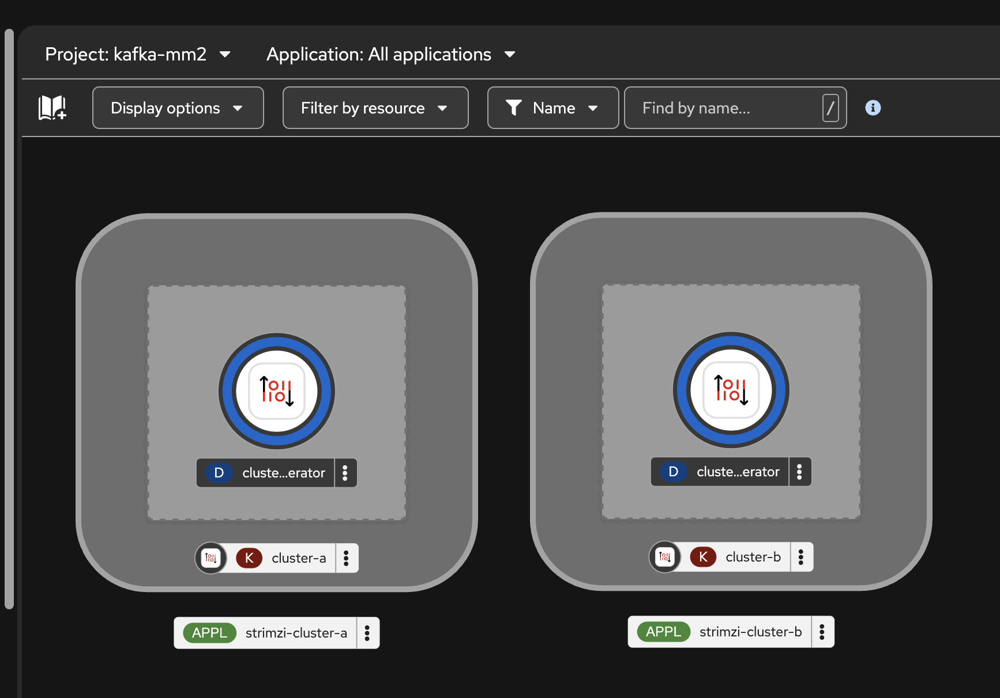
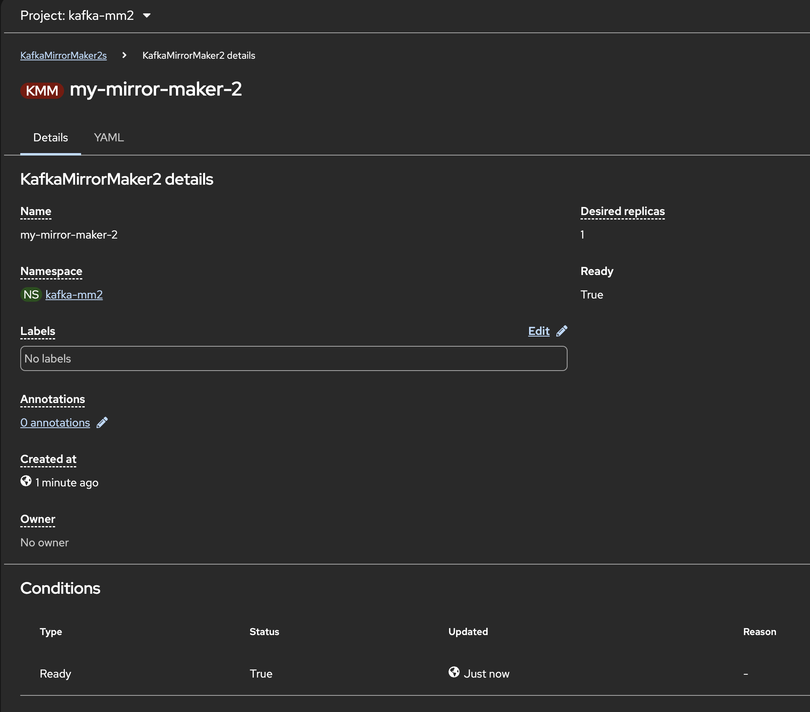
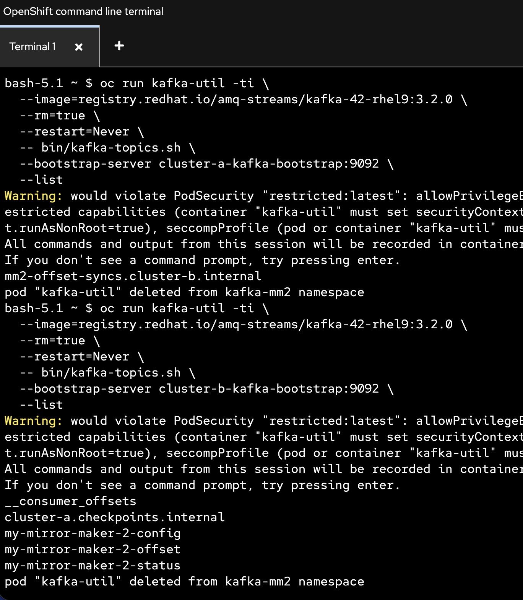
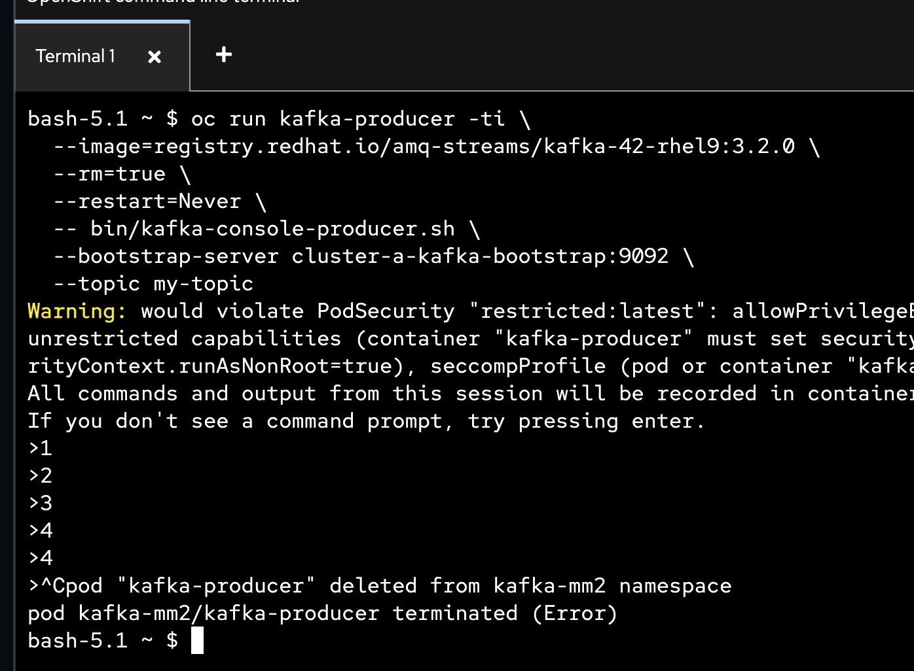
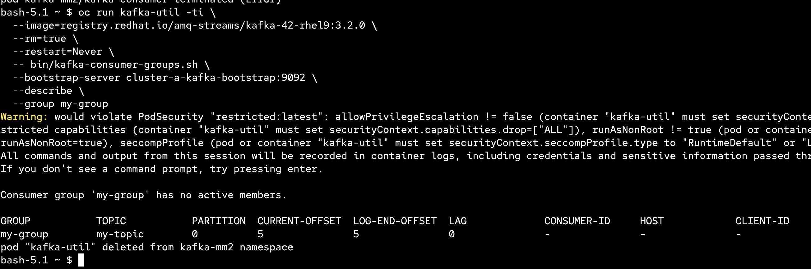
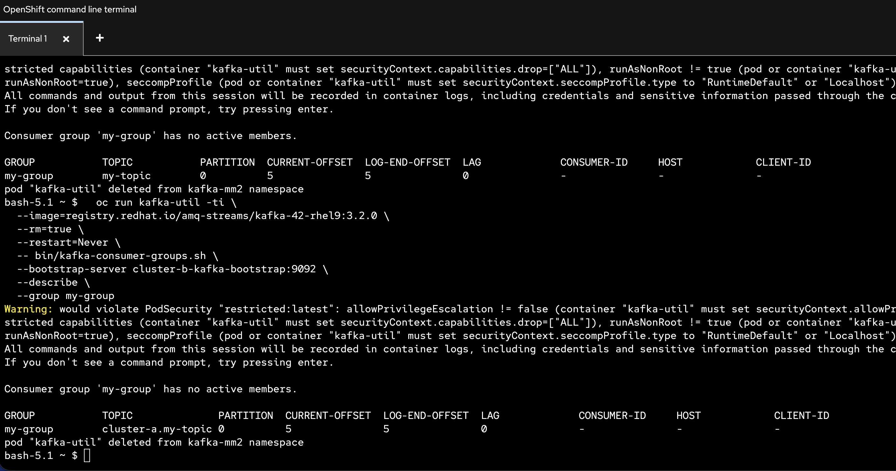

# Mirror Maker 2

> Kafka MirrorMaker replicates data between two or more Kafka clusters, within or across data centers. This process is called mirroring to avoid confusion with the concept of Kafka partition replication. MirrorMaker consumes messages from a source cluster and republishes those messages to a target cluster.

- [Mirror Maker 2](#mirror-maker-2)
  - [Create Source Kafka Cluster (`cluster-a`)](#create-source-kafka-cluster-cluster-a)
  - [Reference](#reference)
  - [Back to Table of Content](#back-to-table-of-content)

---

## Create Source Kafka Cluster (`cluster-a`)

- New Project: `kafka-mm2`

- Create kafka cluster `cluster-a` from [kafka-source.yaml](../manifests/examples/mirror-maker/kafka-source.yaml)

- Create kafka cluster `cluster-b` from [kafka-topic.yaml](../manifests/examples/mirror-maker/kafka-target.yaml)

  

- Create MirrorMaker 2 from [kafka-mirror-maker-2-sync-groups.yaml](../manifests/examples/mirror-maker/kafka-mirror-maker-2-sync-groups.yaml), wait until Ready status change to `True`

  

- Check topics in both cluster 
  
  ```ssh
  oc run kafka-util -ti \
  --image=registry.redhat.io/amq-streams/kafka-42-rhel9:3.2.0 \
  --rm=true \
  --restart=Never \
  -- bin/kafka-topics.sh \
  --bootstrap-server cluster-a-kafka-bootstrap:9092 \
  --list 
  ```

  ```ssh
  oc run kafka-util -ti \
  --image=registry.redhat.io/amq-streams/kafka-42-rhel9:3.2.0 \
  --rm=true \
  --restart=Never \
  -- bin/kafka-topics.sh \
  --bootstrap-server cluster-b-kafka-bootstrap:9092 \
  --list 
  ```  

  example output

  

- Create topic `my-topic` in `cluster-a` from [topic.yaml](../manifests/examples/mirror-maker/topic.yaml)

- Test producer message to `my-topic` in `cluster-a`  

  ```ssh
  oc run kafka-producer -ti \
  --image=registry.redhat.io/amq-streams/kafka-42-rhel9:3.2.0 \
  --rm=true \
  --restart=Never \
  -- bin/kafka-console-producer.sh \
  --bootstrap-server cluster-a-kafka-bootstrap:9092 \
  --topic my-topic

  ```

  example output

    

- Test consume message from `my-topic` in `cluster-a` with group `my-group`

  ```ssh
  oc run kafka-consumer -ti \
  --image=registry.redhat.io/amq-streams/kafka-42-rhel9:3.2.0 \
  --rm=true \
  --restart=Never \
  -- bin/kafka-console-consumer.sh \
  --bootstrap-server cluster-a-kafka-bootstrap:9092 \
  --group my-group \
  --topic my-topic \
  --from-beginning
  ```

- View consumer group `my-group` in `cluster-a`
  
  ```ssh
  oc run kafka-util -ti \
  --image=registry.redhat.io/amq-streams/kafka-42-rhel9:3.2.0 \
  --rm=true \
  --restart=Never \
  -- bin/kafka-consumer-groups.sh \
  --bootstrap-server cluster-a-kafka-bootstrap:9092 \
  --describe \
  --group my-group
  ```

  example output

  

- List topics in `cluster-b`
  
  ```ssh
  oc run kafka-util -ti \
  --image=registry.redhat.io/amq-streams/kafka-42-rhel9:3.2.0 \
  --rm=true \
  --restart=Never \
  -- bin/kafka-topics.sh \
  --bootstrap-server cluster-b-kafka-bootstrap:9092 \
  --list 
  ```   

- View consumer group `my-group` in `cluster-b`
  
  ```ssh
  oc run kafka-util -ti \
  --image=registry.redhat.io/amq-streams/kafka-42-rhel9:3.2.0 \
  --rm=true \
  --restart=Never \
  -- bin/kafka-consumer-groups.sh \
  --bootstrap-server cluster-b-kafka-bootstrap:9092 \
  --describe \
  --group my-group
  ```

  

---

## Reference

- [Configure MirrorMaker 2](https://docs.redhat.com/en/documentation/red_hat_streams_for_apache_kafka/3.2/html-single/deploying_and_managing_streams_for_apache_kafka_on_openshift/index#con-config-mirrormaker2-str)

---

## Back to Table of Content

- [Hands-On Lab: Red Hat Streams for Apache Kafka on OpenShift](../README.md)